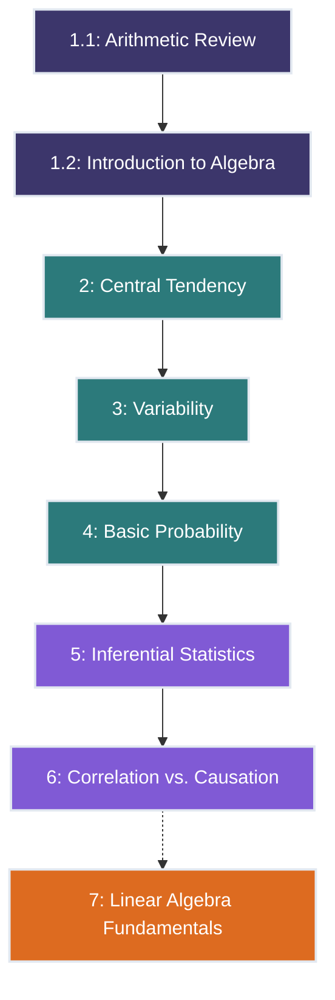

# Essential Mathematics And Statistics for Data Analysis

<h2 style="color: #81e6d9; margin-top: 0;">Course Overview</h2>

<strong>Updated:</strong> April 29, 2025

<strong>Duration:</strong> 14 hours total (6 core lessons + 1 bonus lesson)

## Welcome to the Course!

This course provides the essential mathematical and statistical foundation needed for effective data analysis. Whether you're just starting your journey in data science or looking to strengthen your fundamental knowledge, these lessons will equip you with the core concepts and practical skills required to understand and analyze data effectively.

## Course Structure

## Lesson Overview

| Lesson | Title | Key Concepts | Duration |
|--------|-------|-------------|----------|
| 1.1 | [Arithmetic Review](lessons/lesson_1_1.md) | Basic operations, fractions, decimals, percentages, ratios | 1.5 hours |
| 1.2 | [Introduction to Algebra](lessons/lesson_1_2.md) | Variables, expressions, linear equations, problem solving | 1.5 hours |
| 2 | [Descriptive Statistics - Central Tendency](lessons/lesson_2.md) | Mean, median, mode, central tendency, outliers | 2 hours |
| 3 | [Descriptive Statistics - Variability](lessons/lesson_3.md) | Range, variance, standard deviation, dispersion, consistency | 2 hours |
| 4 | [Basic Probability Concepts](lessons/lesson_4.md) | Probability distributions, normal distribution, real-world applications | 2 hours |
| 5 | [Inferential Statistics Basics](lessons/lesson_5.md) | Population vs sample, hypothesis testing, confidence intervals | 2 hours |
| 6 | [Correlation vs. Causation](lessons/lesson_6.md) | Types of correlation, misinterpretations, establishing causation | 1 hour |
| 7 | [Linear Algebra Fundamentals](lessons/lesson_7.md) | **(Bonus)** Vectors, matrices, transformations, eigenvalues, applications to data analysis | 2 hours |

## Learning Path

This course follows a logical progression:

1. **Foundation Mathematics** - Building the essential arithmetic and algebraic skills
2. **Statistical Fundamentals** - Understanding how to describe and summarize data
3. **Analytical Concepts** - Applying probability, making inferences, and interpreting relationships
4. **Advanced Topics** - Exploring linear algebra foundations for data analysis and machine learning (bonus content)

## Course Prerequisites

- Basic high school mathematics knowledge
- Access to a calculator (physical or digital)
- No prior statistics experience required

## How to Use This Course

1. Follow the lessons in sequence for the most effective learning experience
2. Complete all practice exercises to reinforce concepts
3. Use the provided examples to connect abstract ideas to real-world applications
4. Scan the QR codes in each lesson for additional resources and visual explanations
5. After completing the core lessons (1-6), explore the bonus lesson on Linear Algebra for advanced applications

## Getting Help

If you have questions about the course material:
- Review the glossary sections in each lesson
- Check the recommended resources listed at the end of lessons
- Engage with practice problems to test your understanding

## Let's Get Started!

Begin your journey with [Lesson 1.1: Arithmetic Review](lessons/lesson_1_1.md)

---
