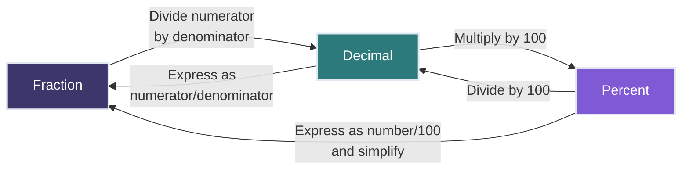
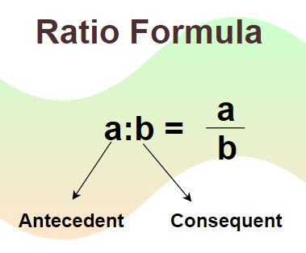
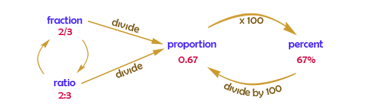
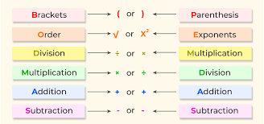
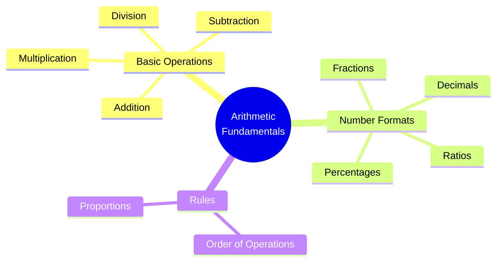

# Lesson 1.1: Arithmetic Review 📊🧮

<h2 style="color: #81e6d9; margin-top: 0;">Essential Mathematics and Statistics for Data Analysis</h2>

<strong>Course Progress:</strong> [◉◯◯◯◯◯] 17% Complete

<strong>Lesson Path:</strong> <mark style="background-color: #4a5568; color: white;">Arithmetic Review</mark> → Introduction to Algebra → Descriptive Statistics → Basic Probability → Inferential Statistics → Correlation

## Overview 🔍
**Duration**: ⏱️ 1.5 hours
**Prerequisites**: 🚫 None - this is the starting point!
**Key Question**: *What are the fundamental arithmetic operations needed for data analysis?*

> 💡 **Why This Matters**: Arithmetic forms the foundation of all mathematical operations used in data analysis. Mastering these concepts will make learning more advanced topics significantly easier.

---

## Learning Objectives 🎯
By the end of this lesson, you will be able to:
- ✅ Apply all four basic arithmetic operations correctly
- ✅ Convert between fractions, decimals, and percentages
- ✅ Understand and manipulate ratios and proportions
- ✅ Apply the order of operations to solve complex expressions

---

## 1. Basic Operations ➕➖✖️➗

These are the four foundational operations in arithmetic:

- **Addition (+)** ➕: Combines numbers
  **Examples:**
  $7 + 3 = 10$
  $-5 + 8 = 3$

- **Subtraction (−)** ➖: Finds the difference between numbers
  **Examples:**
  $12 − 5 = 7$
  $-3 − 6 = -9$

- **Multiplication (×)** ✖️: Repeated addition
  **Examples:**
  $4 × 6 = 24$
  $-2 × 3 = -6$

- **Division (÷)** ➗: Splits a number into equal parts
  **Examples:**
  $20 ÷ 4 = 5$
  $-15 ÷ 3 = -5$

---

## 2. Fractions, Decimals, and Percents 🔢

These are different ways to show parts of a whole. You can switch between them by using simple math.

### Conversion Chart 📊

### Explanation 🧩

- **Fraction** 🍕: Shows part of a whole using two numbers (top and bottom).
  Example: $\frac{3}{4}$ means 3 parts out of 4 total.

- **Decimal** 🔟: Another way to write a fraction using a dot (.)
  Example: $0.75$ is the same as $\frac{3}{4}$.

- **Percent** 💯: Tells how many parts out of 100.
  Example: $75\%$ means 75 out of 100.

### 🔁 Conversions:

- **Fraction → Decimal** 🔄: Divide numerator by denominator
  $3 ÷ 4 = 0.75$

- **Decimal → Percent** 🔄: Multiply by 100
  $0.75 × 100 = 75\%$

- **Percent → Fraction** 🔄: Write over 100 and simplify
  $75\% = \frac{75}{100} = \frac{3}{4}$

---

## 3. Ratios and Proportions ⚖️

### Ratios 📏

A **ratio** is a way to compare two amounts. It shows how much of one thing there is compared to another.

You can write a ratio in three ways:
- With a colon: $3:5$
- As a fraction: $\frac{3}{5}$
- With words: "3 to 5"

In a ratio:
- The first number is called the **antecedent**
- The second number is the **consequent**

**Example:** 📚
If there are 3 boys and 5 girls in a class, the ratio of boys to girls is:
$\frac{3}{5}$
This means there are 3 boys for every 5 girls in the class.

---

### Proportions 📐

A **proportion** is when two ratios or two fractions are equal.

Think of it like this:

If two things are being compared in the same way, they form a proportion.

#### Formula ✍️:
$\frac{a}{b} = \frac{c}{d}$
This means that $a$ is to $b$ as $c$ is to $d$.

### Example 🧪

If we say: $2:3 = 4:6$, then:

We can write it as:

$\frac{2}{3} = \frac{4}{6}$

Now check if this is true by cross multiplying:

$2 \times 6 = 3 \times 4$

Both sides equal $12$ — so the proportion is **true**! ✅

### Data Analysis Connection 📈

In data analysis, ratios and proportions help us:
- 📊 Compare different groups in datasets
- 📏 Scale data appropriately
- 📉 Calculate rates and trends
- 🔄 Convert between units of measurement

---

## 4. Flow Between All Forms 🔄

This diagram shows how **fractions**, **decimals**, **percents**, **ratios**, and **proportions** are all connected and can be converted into each other.

### Summary of Conversions 📋

You can easily switch between the different forms:

- **Fraction → Decimal** 🔢:
  Divide the top number by the bottom number.
  Example: $\frac{3}{4} = 0.75$

- **Decimal → Percent** 💯:
  Multiply the decimal by 100.
  Example: $0.75 × 100 = 75\%$

- **Percent → Decimal** 🔟:
  Divide the percent by 100.
  Example: $75\% ÷ 100 = 0.75$

- **Ratio → Fraction** ⚖️:
  A ratio like $2:5$ is the same as the fraction $\frac{2}{5}$.

- **Fraction or Ratio → Proportion** 📐:
  A proportion is when two fractions or ratios are equal.
  Example: $\frac{2}{3} = \frac{4}{6}$ → This is a proportion.

---

## 5. Order of Operations (PEMDAS / BODMAS) 🔢

When solving math problems, the **order** in which you do operations matters.

If you don't follow the correct order, you might get the wrong answer.

### What is PEMDAS or BODMAS? 🤔

These are acronyms that help you remember the order:

- **P / B** – Parentheses / Brackets 🔠
- **E / O** – Exponents / Orders (like powers and roots) 🔠
- **MD** – Multiplication and Division (from left to right) 🔠
- **AS** – Addition and Subtraction (from left to right) 🔠

> ⚠️ Remember: Do multiplication and division **in the order they appear**, not always multiplication first. Same with addition and subtraction.

### Guide 📝

This chart shows how each operation appears and is grouped.

---

### Example 1 🧮

Solve:
$5 + 3 × 2$

- **Step 1:** Do the multiplication first:
  $3 × 2 = 6$
- **Step 2:** Do the addition:
  $5 + 6 = 11$

---
### Example 2 🧮
Solve:
$(6 + 4) ÷ 2^2$

**Step-by-step:**

1. Parentheses:
   $6 + 4 = 10$
2. Exponents:
   $2^2 = 4$
3. Division:
   $10 ÷ 4 = 2.5$

 **Answer: 2.5** ✅

---

## Practice Examples 🏋️‍♀️

### Example 1: Converting Between Forms 🔄

Convert $\frac{3}{8}$ to a decimal and a percent.

Click for Solution 💡

**Step 1:** Convert to decimal
$3 ÷ 8 = 0.375$

**Step 2:** Convert to percent
$0.375 × 100 = 37.5\%$

**Answer:** $\frac{3}{8} = 0.375 = 37.5\%$ ✅

### Example 2: Order of Operations 🧮

Calculate: $4 + 2 × (8 - 5)^2$

Click for Solution 💡

**Step 1:** Solve inside parentheses
$8 - 5 = 3$

**Step 2:** Apply exponent
$3^2 = 9$

**Step 3:** Multiplication
$2 × 9 = 18$

**Step 4:** Addition
$4 + 18 = 22$

**Answer:** $22$ ✅

### Example 3: Solving Proportions ⚖️

If 3 notebooks cost $6, how much would 5 notebooks cost?

Click for Solution 💡

**Step 1:** Set up a proportion
$\frac{3}{6} = \frac{5}{x}$

**Step 2:** Cross multiply
$3x = 6 × 5$
$3x = 30$

**Step 3:** Solve for x
$x = 30 ÷ 3$
$x = 10$

**Answer:** 5 notebooks would cost $10 💵

---

## Key Takeaways 🗝️

1. ✅ Master the four basic operations: addition, subtraction, multiplication, and division
2. ✅ Convert freely between fractions, decimals, and percentages
3. ✅ Use ratios to express relationships between quantities
4. ✅ Set up proportions to solve for unknown values
5. ✅ Always apply operations in the correct order using PEMDAS

---

<h3 style="color: #81e6d9; margin-top: 0;">Next Lesson: Introduction to Algebra ➡️</h3>

In the next lesson, we'll build on these arithmetic foundations to explore algebraic concepts crucial for data analysis, including variables, expressions, and solving basic equations.

<a href="lesson_1_2.md" style="color: #90cdf4;">Continue to Lesson 1.2 →</a>

