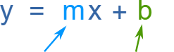
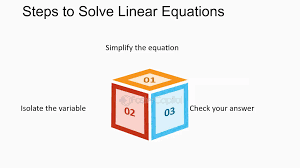
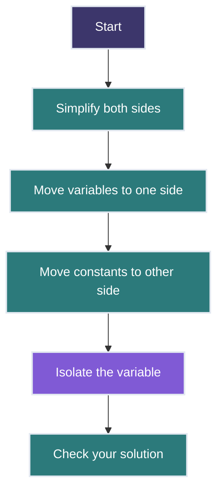
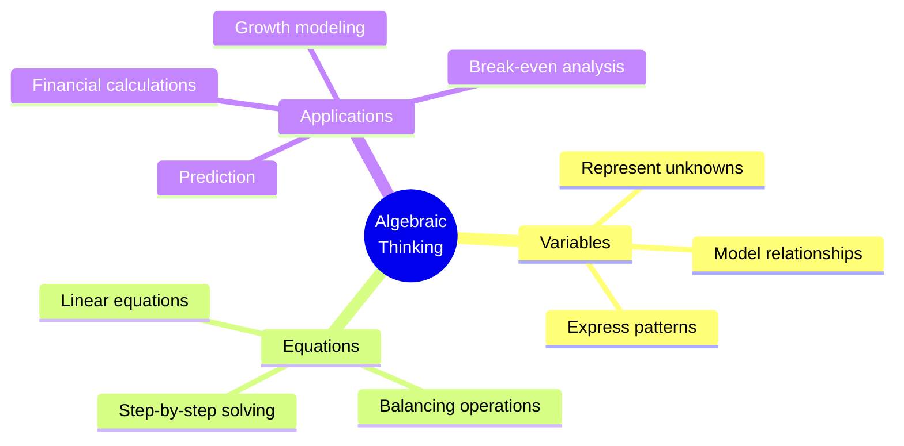

# Lesson 1.2: Introduction to Algebra 📐🧮

<h2 style="color: #81e6d9; margin-top: 0;">Essential Mathematics and Statistics for Data Analysis</h2>

<strong>Course Progress:</strong> [◉◉◯◯◯◯] 33% Complete

<strong>Lesson Path:</strong> <a href="lesson_1_1.md" style="color: #90cdf4;">Arithmetic Review</a> → <mark style="background-color: #4a5568; color: white;">Introduction to Algebra</mark> → Descriptive Statistics → Basic Probability → Inferential Statistics → Correlation

## Overview 🔍
**Duration**: ⏱️ 1.5 hours
**Prerequisites**: 📚 Basic arithmetic operations (Lesson 1.1)
**Key Question**: *How can we use variables and expressions to model real-world relationships?*

> 💡 **Why This Matters**: Algebra is the language of data relationships. It gives us tools to express patterns, model data, and solve problems systematically - essential skills for data analysis.

---

## Learning Objectives 🎯
By the end of this lesson, you will be able to:
- ✅ Understand what variables are and how they're used in data analysis
- ✅ Recognize and interpret different parts of algebraic expressions
- ✅ Solve linear equations using algebraic methods
- ✅ Apply algebraic thinking to solve real-world problems

---

## 1. What Is a Variable? 🔤

A **variable** is a letter (like `x`, `y`, or `n`) that represents a number we don't know yet.

**Example:** 📝

$x + 3 = 7$

- $x$ is the unknown number (variable) ❓
- We solve it by subtracting 3 from both sides:
  $x = 7 - 3$ → $x = 4$ ✓

### Variables in Data Analysis 📊
In data analysis, variables often represent:
- 📏 Measurements we collect (e.g., height, weight, temperature)
- 🎯 Values we want to predict
- 🧮 Parameters in statistical models
- 🔢 Quantities in algorithms and formulas

---

## 2. Parts of an Algebraic Expression 📝

.png)

In the expression $7n + 2$:
- $7$ is the **coefficient** (it multiplies the variable) 🔢
- $n$ is the **variable** 🔤
- $2$ is the **constant** 🔣
- $+$ is the operation ➕

### Types of Expressions 📋

| Type | Example | Description |
|------|---------|------------|
| **Monomial** | $5x$ | Single term with variable(s) |
| **Binomial** | $3x + 4$ | Two terms connected by + or - |
| **Polynomial** | $2x^2 + 5x - 3$ | Multiple terms with different powers |

---

## 3. What Is a Linear Equation? 📈

A **linear equation** is an equation whose graph is a straight line.
The basic form is:
$y = mx + b$

Where:
- $m$ is the slope (how steep the line is) 📈
- $b$ is the y-intercept (where it crosses the y-axis) 📍

### Data Analysis Connection 🔗

Linear equations are foundational in:
- 📊 Linear regression for prediction
- 📈 Trend line analysis
- ⚖️ Feature scaling
- 💰 Budget projections

---

## 4. How to Solve Simple Linear Equations ➗

### Example 1 🧮

Solve: $x + 5 = 9$

**Step 1:** Subtract 5 from both sides ➖
$x = 9 - 5$
$x = 4$ ✓

---

### Example 2 🔢

Solve: $3n - 4 = 11$

**Step 1:** Add 4 to both sides ➕
$3n = 15$
**Step 2:** Divide by 3 ➗
$n = 5$ ✓

### Key Principle ⚖️
What you do to one side of the equation, you must do to the other side to keep the equation balanced.

---

## 5. Solving Practical Math Problems with Algebra 🧩

Algebra is not just for classrooms — it's used in real-life situations like shopping, saving money, growth analysis, and data science applications.

### Sales Discounts 🛍️

**Problem:**
A jacket costs $80 and is on sale for 25% off. What is the sale price?

**Step 1: Find the discount** 💹
25% of $80 =
$0.25 \times 80 = 20$

**Step 2: Subtract the discount from the original price** ➖
$80 - 20 = 60$

**Answer:** The sale price is **$60** 💵

### Growth Rates 🌱

**Problem:**
A tree is 150 cm tall and grows 12 cm each year.
How tall will it be in 5 years?

**Equation:**
$\text{Height} = 150 + 12 \times 5 = 150 + 60 = 210$

**Answer:** The tree will be **210 cm tall** in 5 years. 🌳

---

### Basic Equation: Saving Money 💰

**Problem:**
You have $20 and save $5 each week.
How many weeks until you have $65?

Let $x$ be the number of weeks.

**Equation:**
$20 + 5x = 65$

**Step 1: Subtract 20 from both sides** ➖
$5x = 45$

**Step 2: Divide both sides by 5** ➗
$x = 9$

**Answer:** It will take **9 weeks** to save $65. ⏳

### Data Analysis Connection 🔗
These algebraic methods can be applied to:
- 📈 Growth rate calculations
- 🔮 Forecasting and trend analysis
- 💹 Budget modeling
- 💸 Return on investment calculations

---

## Practice Examples 🏋️‍♀️

### Example 1: Modeling Data Trends 📊

A company's sales have been growing linearly. They had $50,000 in sales in 2020 and $80,000 in 2023. If this trend continues, what will their sales be in 2025?

Click for Solution 💡

**Step 1:** Find the annual growth rate 📈
Time between measurements: $2023 - 2020 = 3$ years
Total growth: $\$80,000 - \$50,000 = \$30,000$
Annual growth rate: $\$30,000 \div 3 = \$10,000$ per year

**Step 2:** Write an equation ✍️
Let $x = \text{years after 2020}$
$\text{Sales} = \$50,000 + \$10,000x$

**Step 3:** Calculate sales for 2025 🧮
2025 is 5 years after 2020, so $x = 5$
$\text{Sales} = \$50,000 + \$10,000(5) = \$50,000 + \$50,000 = \$100,000$

**Answer:** $\$100,000$ in sales projected for 2025 💰

### Example 2: Conversion Rates 🔄

A marketing campaign gets 2,400 views and 96 sign-ups. If the team wants 250 sign-ups, how many views do they need (assuming the same conversion rate)?

Click for Solution 💡

**Step 1:** Find the conversion rate 📊
$\text{Rate} = 96 \text{ sign-ups} \div 2,400 \text{ views} = 0.04$ (or 4%)

**Step 2:** Set up a proportion ⚖️
$\frac{96}{2,400} = \frac{250}{x}$

**Step 3:** Cross multiply and solve for x 🧮
$96x = 2,400 \times 250$
$96x = 600,000$
$x = 600,000 \div 96$
$x = 6,250$

**Answer:** They need 6,250 views to get 250 sign-ups 👁️

### Example 3: Break-even Analysis 💼

A product costs $15 to make and sells for $25. Fixed monthly costs are $2,000. How many units need to be sold each month to break even?

Click for Solution 💡

**Step 1:** Define the variables 📝
Let $x = \text{number of units to break even}$
$\text{Revenue} = \$25x$
$\text{Variable costs} = \$15x$
$\text{Fixed costs} = \$2,000$

**Step 2:** Set up the break-even equation ⚖️
$\text{Revenue} = \text{Variable costs} + \text{Fixed costs}$
$\$25x = \$15x + \$2,000$

**Step 3:** Solve for x 🧮
$\$25x - \$15x = \$2,000$
$\$10x = \$2,000$
$x = \$2,000 \div \$10$
$x = 200$

**Answer:** They need to sell 200 units per month to break even 📊

---

## Key Takeaways 🗝️

1. ✅ Variables allow us to express unknown quantities and their relationships
2. ✅ Algebraic expressions have distinct parts: coefficients, variables, and constants
3. ✅ Linear equations can be solved systematically by isolating the variable
4. ✅ The equation $y = mx + b$ models a straight line with slope $m$ and y-intercept $b$
5. ✅ Algebra helps solve real-world problems by creating mathematical models

---

<h3 style="color: #81e6d9; margin-top: 0;">Next Lesson: Descriptive Statistics ➡️</h3>

In the next lesson, we'll begin exploring statistics with measures of central tendency including mean, median, and mode - fundamental concepts for analyzing datasets.

<a href="lesson_2.md" style="color: #90cdf4;">Continue to Lesson 2 →</a>

