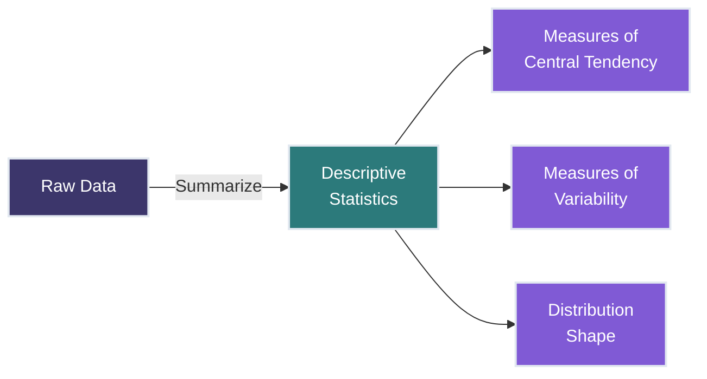
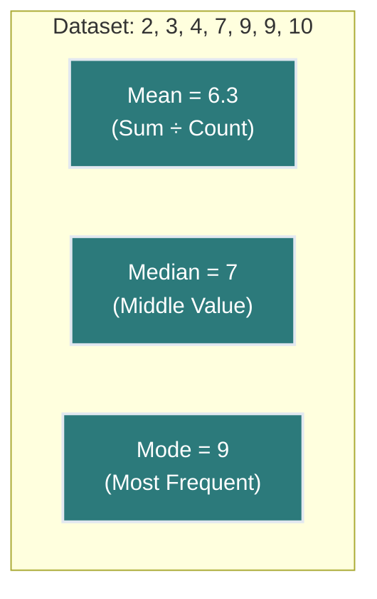
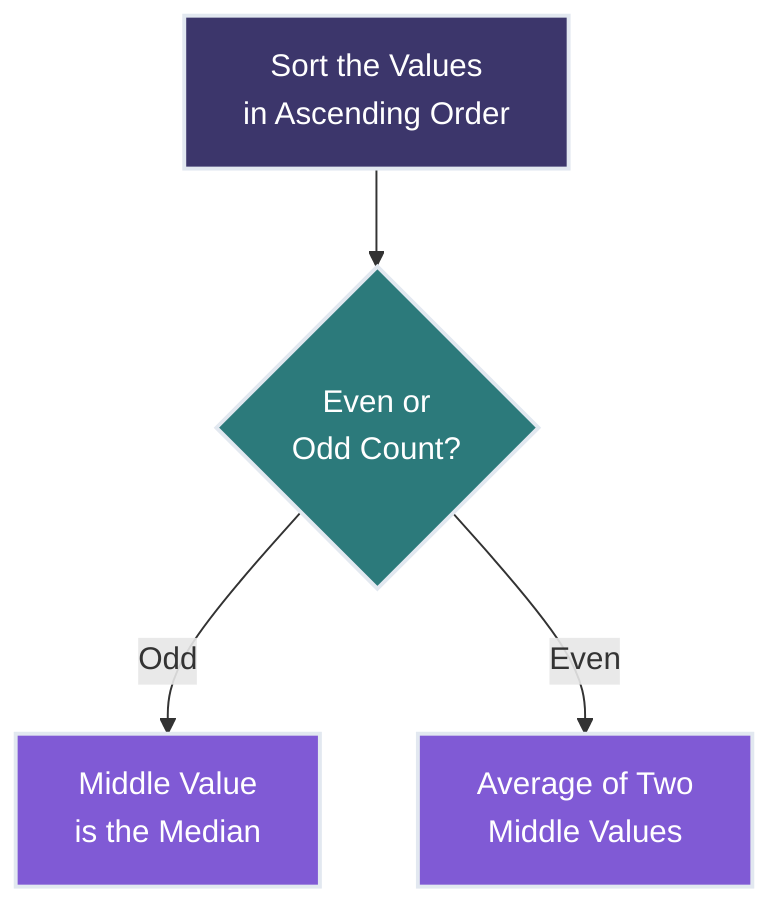
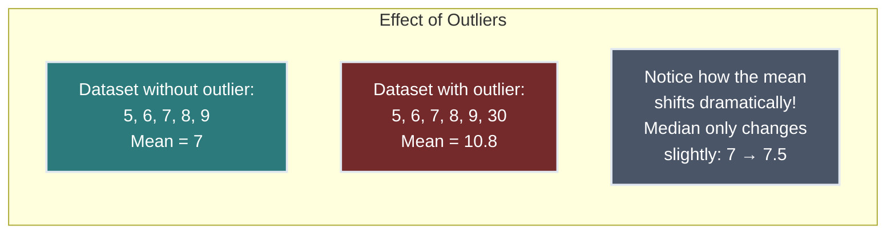
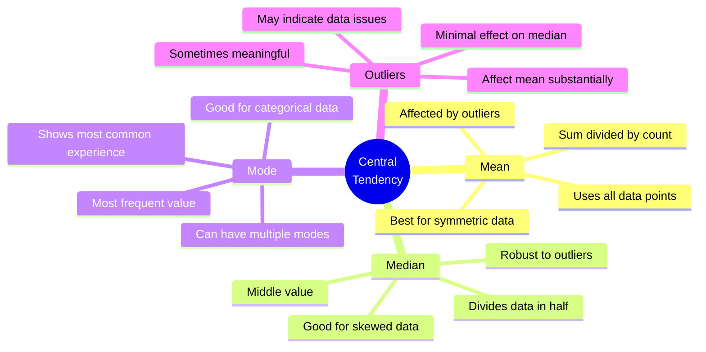

# Lesson 2: Descriptive Statistics: Central Tendency 📊📈

<div style="background-color: #2d3748; color: white; padding: 15px; border-radius: 10px; margin-bottom: 20px;">
<h2 style="color: #81e6d9; margin-top: 0;">Essential Mathematics and Statistics for Data Analysis</h2>
<p><strong>Course Progress:</strong> [◉◉◉◯◯◯] 50% Complete</p>
<p><strong>Lesson Path:</strong> <a href="lesson_1_1.md" style="color: #90cdf4;">Arithmetic Review</a> → <a href="lesson_1_2.md" style="color: #90cdf4;">Introduction to Algebra</a> → <mark style="background-color: #4a5568; color: white;">Descriptive Statistics</mark> → Basic Probability → Inferential Statistics → Correlation</p>
</div>

## Overview 🔍
**Duration**: ⏱️ 2 hours
**Prerequisites**: 📚 Basic arithmetic operations (Lesson 1.1)
**Key Question**: *How do we find the "center" of a dataset and describe its typical values?*

> 💡 **Why This Matters**: Descriptive statistics helps us summarize and understand large datasets at a glance. Measures of central tendency are among the most important tools in a data analyst's toolkit for extracting insights from data.

---

## Learning Objectives 🎯
By the end of this lesson, you will be able to:
- ✅ Calculate and interpret the three main measures of central tendency (mean, median, mode)
- ✅ Choose the appropriate measure for different data distributions
- ✅ Identify outliers and understand their impact on statistical measures
- ✅ Apply central tendency concepts to real-world datasets

---

## 1. What is Descriptive Statistics? 🧪

**Descriptive statistics** is a branch of statistics that deals with summarizing and organizing data so it can be easily understood. It provides simple summaries about the features of a dataset, including measures of central tendency, variability, and distribution.



In this lesson, the focus is on **measures of central tendency**, which help identify a single value that best represents the center or typical value of a dataset.

---

## 2. What is Central Tendency? 🎯

**Central Tendency** refers to identifying the center or typical value in a dataset.

The three primary measures are:

- **Mean** 📊 – the average
- **Median** 📏 – the middle number
- **Mode** 🔢 – the most frequent number



---

## 3. Mode – The Most Frequent Value 🔢

### Definition 📝

The **mode** is the number that appears most frequently in a dataset.

---

### Example 🧮


Dataset:
`[6, 3, 9, 6, 6, 5, 9, 3]`

The number **6** appears **three times**, more than any other.

**Mode = 6** ✓

---

### Steps to Find the Mode 📋

1. 🔍 Arrange the numbers in order (optional but helpful).
2. 🧮 Count how often each number appears.
3. 🏆 The number with the highest frequency is the **mode**.

---

### Example 🧪

Dataset:
`3, 7, 5, 13, 20, 23, 39, 23, 40, 23, 14, 12, 56, 23, 29`

Sorted:
`3, 5, 7, 12, 13, 14, 20, 23, 23, 23, 23, 29, 39, 40, 56`

**Mode = 23** ✓

---

### Additional Example 📚

Dataset:
`[19, 8, 29, 35, 19, 28, 15]`
Sorted: `[8, 15, 19, 19, 28, 29, 35]`

**Mode = 19** ✓

---

### Multiple Modes 🔀

Dataset:
`[1, 3, 3, 3, 4, 4, 6, 6, 6, 9]`

**3** and **6** both appear three times.

**This is bimodal (two modes).** 📈📈
More than two modes is called **multimodal**. 📊📊📊

---

### Mode from Grouped Data 📋

When all values appear once, grouping can help identify a mode.

Example:
`[4, 7, 11, 16, 20, 22, 25, 26, 33]`

Group into intervals of 10:

- 0–9: 2 values
- 10–19: 2 values
- 20–29: 4 values 🏆
- 30–39: 1 value

Most values are in the 20–29 group. The approximate mode is **25**.

---

### Data Analysis Connection 🔗

The mode is especially useful in data analysis for:
- 📊 Finding the most common category in categorical data
- 🛒 Identifying the most popular product in sales data
- 🛠️ Understanding the most frequent issue in customer service data
- 📈 Recognizing the most common values in multi-modal distributions

---

## 4. Mean – The Average ➗

### Definition 📝

The **mean** is the sum of all values divided by the number of values.

Formula: $\bar{x} = \frac{\sum_{i=1}^{n} x_i}{n}$ 🧮

---

### Example 🧪

Dataset:
`6, 11, 7`

- Sum: 6 + 11 + 7 = 24
- Count: 3
- Mean = 24 ÷ 3 = **8** ✓

---

### Visual Explanation 👁️


The mean evenly distributes values.

---

### Larger Example 📊

Dataset:
`3, 7, 5, 13, 20, 23, 39, 23, 40, 23, 14, 12, 56, 23, 29`

- Sum: 330
- Count: 15
- Mean = 330 ÷ 15 = **22** ✓

---

### Including Negative Numbers ➖

Dataset:
`3, −7, 5, 13, −2`

- Sum: 12
- Count: 5
- Mean = 12 ÷ 5 = **2.4** ✓

### Data Analysis Connection 🔗

The mean is commonly used in data analysis for:
- 💵 Calculating average sales, costs, or revenues
- 📱 Determining average user engagement or retention
- 📊 Finding the center point of normally distributed data
- 📈 Baseline comparison for future measurements

---

## 5. Median – The Middle Value ↔️

### Definition 📝

The **median** is the middle number in a sorted list.



---

### Visual Explanation 👁️


---

### Example 🧪

Dataset:
`12, 3, 5`
Sorted: `3, 5, 12`

**Median = 5** ✓

---

### Larger Example 📊

Dataset:
`3, 13, 7, 5, 21, 23, 39, 23, 40, 23, 14, 12, 56, 23, 29`

Sorted:
`3, 5, 7, 12, 13, 14, 21, 23, 23, 23, 23, 29, 39, 40, 56`

**15 values → Median = 8th value = 23** ✓

---

### Even Number of Values ⚖️

Dataset:
`3, 13, 7, 5, 21, 23, 23, 40, 23, 14, 12, 56, 23, 29`

Sorted:
`3, 5, 7, 12, 13, 14, 21, 23, 23, 23, 23, 29, 40, 56`

**14 values → middle values: 21 and 23**
**Median = (21 + 23) ÷ 2 = 22** ✓

---

### Median Position Formula 📐

Use this to find the median's position in a list:

- If count is odd:
  $(number\ of\ values + 1) \div 2$ = position of the median

- If count is even:
  Find the two middle values and average them

Example (45 values):
→ $(45 + 1) \div 2 = 23$ → 23rd value is the median ✓

Example (66 values):
→ $(66 + 1) \div 2 = 33.5$ → Use the 33rd and 34th values ✓

### Data Analysis Connection 🔗

The median is particularly useful in data analysis for:
- 🏠 Analyzing home prices, salaries, or other skewed distributions
- 📊 Finding the middle value when outliers would distort the mean
- 👥 Understanding the "typical" experience in customer surveys
- 📏 Determining the midpoint in ranked data

---

## 6. Choosing the Right Measure 🧠

| Situation                         | Appropriate Measure | Reason                                 |
|----------------------------------|---------------------|----------------------------------------|
| No outliers                      | Mean 📊             | Includes all values                    |
| Outliers present                 | Median 📏           | Not influenced by extreme values       |
| Data with repeating values       | Mode 🔢             | Shows the most frequent outcome        |
| Irregular data or timing tasks  | Grouped Mode 📋      | Best for analyzing ranges or patterns  |

---

## 7. Outliers and Their Effects on Data ⚠️

**Outliers** are values that are very different from the rest of the data — they "lie outside" the main group.




Sometimes outliers are just natural variations, and sometimes they point to unusual circumstances. Understanding how they affect our analysis is essential.

---

### Long Jump Example 🏃‍♂️


A coach has been training a Long Jump team. Here are the improvements in jumping distance (in meters):

- Augustus: +0.15
- Tom: +0.11
- June: +0.06
- Carol: +0.06
- Bob: +0.12
- Sam: **-0.56** ← Sam performed worse ⚠️

### Visualizing the Data 📉


---

### Calculating the Mean 🧮

**Including Sam**:
$(0.15 + 0.11 + 0.06 + 0.06 + 0.12 - 0.56) \div 6 = -0.01$
**Mean = -0.01** 📉

The average suggests performance dropped, but that doesn't reflect most athletes.

---

### What If We Remove the Outlier? 🤔


**Without Sam**:
$(0.15 + 0.11 + 0.06 + 0.06 + 0.12) \div 5 = 0.10$
**Mean = 0.10** 📈

Now it looks like the team improved! But...

> ⚠️ Is it fair to remove data just because we don't like it?

---

### Context Matters 🔍


Sam was feeling sick that day — not the coach's fault. In this case, removing the outlier might be justified.

 **Important:** ⚠️ If you remove an outlier, always explain **why** and document your reasoning.

---

### Comparing Mean, Median, and Mode 📊

Let's see how different measures of central tendency behave:

- **Mean with Sam**: -0.01
- **Mean without Sam**: 0.10

- **Median with Sam**: 0.085
- **Median without Sam**: 0.11

- **Mode (both cases)**: 0.06

➡️ The **mean** is heavily affected by the outlier,
➡️ The **median** shifts slightly,
➡️ The **mode** stays the same.

---

### Skewness and Outliers 📉

Outliers can create **skewness** in data. Skewness is when the data is not symmetrical:

- **Right-skewed** (positive skew): a few large values pull the mean higher 📈
- **Left-skewed** (negative skew): a few small values pull the mean lower 📉

In our example, Sam's low result causes a **left skew**.

➡️ **Skewed data can distort the mean**, so the **median** may give a better idea of "typical" values.

---

### Data Analysis Connection 🔗

Understanding outliers is critical in data analysis because they can:
- 📊 Distort statistical measures and prediction models
- 💡 Reveal important insights or special cases
- ⚠️ Indicate data collection errors
- 🎯 Point to unique segments requiring special attention

---

## Practice Activities 🏋️‍♀️

### Activity 1: Calculate Central Tendency 🧮

Given the following data:

`5, 6, 6, 7, 7, 8, 9, 40`

1. Calculate the **mean**, **median**, and **mode**
2. Identify the outlier
3. Recalculate the values **without** the outlier
4. Discuss the differences

<details>
<summary>Click for Solution 💡</summary>

With outlier:
- Mean: $(5+6+6+7+7+8+9+40)/8 = 88/8 = 11$
- Median: $(7+7)/2 = 7$ (middle values in sorted list)
- Mode: 6 and 7 (both appear twice)

Outlier: 40 ⚠️

Without outlier:
- Mean: $(5+6+6+7+7+8+9)/7 = 48/7 = 6.86$
- Median: 7
- Mode: 6 and 7

Differences:
- The mean decreased significantly (11 → 6.86) 📉
- The median remained the same (7) ➡️
- The mode remained the same (6 and 7) ➡️

This demonstrates how the mean is highly sensitive to outliers, while the median and mode are more robust.
</details>

---

### Activity 2: Real-World Application 🌎

**Scenario:** You are analyzing salaries at a small company with 10 employees:

```
$45,000, $48,000, $50,000, $52,000, $53,000,
$54,000, $55,000, $58,000, $60,000, $350,000 (CEO)
```

<details>
<summary>Discussion Questions 🤔</summary>

1. Calculate the mean, median, and mode of these salaries.
2. Which measure best represents the "typical" employee salary? Why?
3. If you were reporting the average salary to potential new hires, which measure would be most honest to use?
4. How could using the wrong measure potentially mislead people?
</details>

---

## Key Takeaways 🗝️



1. ✅ The **mean** is the arithmetic average and uses all data points.
2. ✅ The **median** is the middle value and is less affected by outliers.
3. ✅ The **mode** shows the most frequent value and works well for categorical data.
4. ⚠️ **Outliers** affect the mean significantly but have less impact on the median.
5. 🧠 The best measure depends on your data distribution and analysis goals.

---

<div style="background-color: #2d3748; color: white; padding: 15px; border-radius: 10px; margin-top: 20px;">
<h3 style="color: #81e6d9; margin-top: 0;">Next Lesson: Descriptive Statistics - Variability ➡️</h3>
<p>In the next lesson, we'll explore measures of data spread and variability, including range, variance, and standard deviation.</p>
<p><a href="lesson_3.md" style="color: #90cdf4;">Continue to Lesson 3 →</a></p>
</div>
