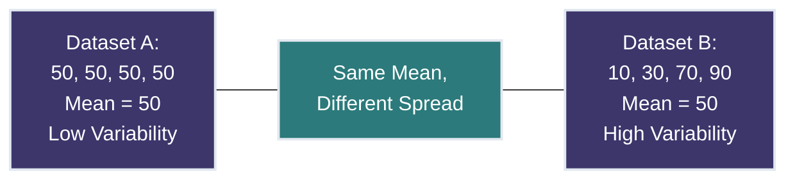
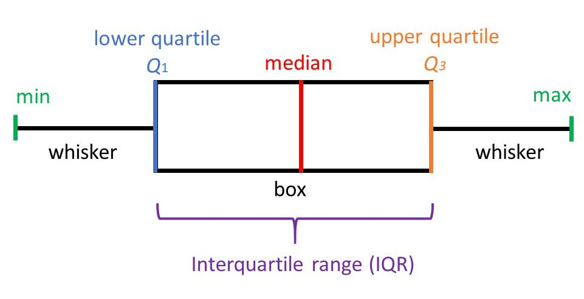
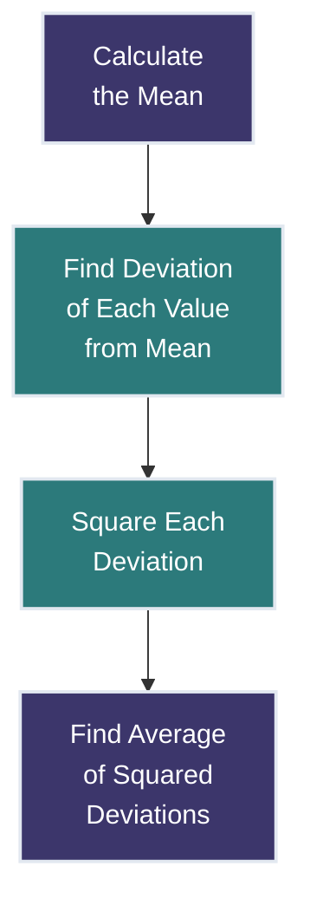
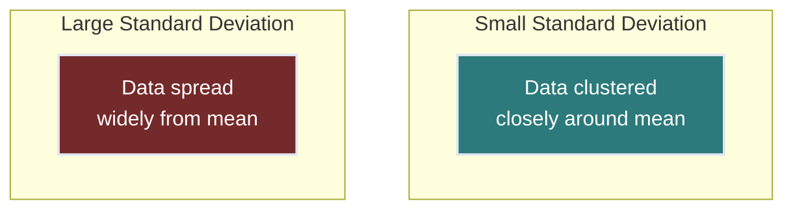
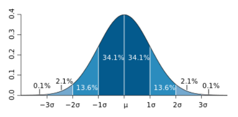
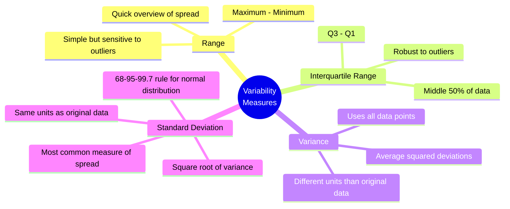

# Lesson 3: Descriptive Statistics: Variability 📊📏

<div style="background-color: #2d3748; color: white; padding: 15px; border-radius: 10px; margin-bottom: 20px;">
<h2 style="color: #81e6d9; margin-top: 0;">Essential Mathematics and Statistics for Data Analysis</h2>
<p><strong>Course Progress:</strong> [◉◉◉◉◯◯] 67% Complete</p>
<p><strong>Lesson Path:</strong> <a href="lesson_1_1.md" style="color: #90cdf4;">Arithmetic Review</a> → <a href="lesson_1_2.md" style="color: #90cdf4;">Introduction to Algebra</a> → <a href="lesson_2.md" style="color: #90cdf4;">Central Tendency</a> → <mark style="background-color: #4a5568; color: white;">Variability</mark> → Basic Probability → Inferential Statistics → Correlation</p>
</div>

## Overview 🔍
**Duration**: ⏱️ 2 hours
**Prerequisites**: 📚 Descriptive Statistics - Central Tendency (Lesson 2)
**Key Question**: *How do we measure and interpret the spread of data around its center?*

> 💡 **Why This Matters**: While measures of central tendency tell us about typical values, measures of variability reveal how spread out the data is. Understanding variability helps assess consistency, reliability, and risk in data—critical skills for any data analyst.

---

## Learning Objectives 🎯
By the end of this lesson, you will be able to:
- ✅ Calculate and interpret the range, variance, and standard deviation
- ✅ Understand when to use different measures of dispersion
- ✅ Analyze the consistency and reliability of datasets
- ✅ Apply variability concepts to compare real-world datasets
- ✅ Visualize and communicate the spread of data effectively

---

## 1. What is Variability? 📈📉

**Variability** (also called dispersion or spread) measures how far apart data points are from each other and from the center of the distribution.

Two datasets might have the same mean but very different patterns of variability:



### Why Variability Matters 🤔

Understanding data variability helps you:

1. Assess **consistency** 📏 (Are products manufactured to similar specifications?)
2. Evaluate **reliability** ⚙️ (How consistently does a system perform?)
3. Measure **risk** 📉 (How volatile is an investment?)
4. Determine **data quality** 🔍 (Are there unusual patterns suggesting errors?)
5. Make **accurate predictions** 🔮 (What range of outcomes can we expect?)

---

## 2. Range - The Simplest Measure of Spread 📏

### Definition 📝

The **range** is the difference between the maximum and minimum values in a dataset.

Formula:
$$\text{Range} = \text{Maximum value} - \text{Minimum value}$$

---

### Example 🧮

Dataset:
`15, 20, 35, 40, 50`

- Maximum value: 50
- Minimum value: 15

Range = 50 - 15 = **35** ✓

---

### Visual Explanation 👁️


The range spans from the smallest to the largest value.

---

### Advantages and Limitations ⚖️

**Advantages** ✅:
- Simple to calculate and understand
- Gives a quick overview of data spread
- Useful for quick comparisons

**Limitations** ⚠️:
- Only uses two data points (minimum and maximum)
- Very sensitive to outliers
- Doesn't show how data is distributed between extremes

---

### Example with Outlier 🧪

Dataset:
`15, 20, 35, 40, 50, 200`

Range = 200 - 15 = **185** ✓

The single outlier (200) dramatically increases the range, potentially giving a misleading impression of the overall data spread.

---

### Interquartile Range (IQR) 📊

To overcome the range's sensitivity to outliers, we often use the **Interquartile Range (IQR)** instead.

The IQR measures the middle 50% of data, ignoring the lowest 25% and highest 25%.

Formula:
$$\text{IQR} = Q_3 - Q_1$$

Where:
- $Q_1$ = 1st quartile (25th percentile)
- $Q_3$ = 3rd quartile (75th percentile)



---

### Data Analysis Connection 🔗

The range and IQR are particularly useful in data analysis for:
- 🔍 Quick assessment of data spread
- ⚠️ Identifying potential outliers (values > $Q_3 + 1.5 \times \text{IQR}$ or < $Q_1 - 1.5 \times \text{IQR}$)
- 📊 Creating box plots to visualize data distribution
- 📈 Comparing spread across different categories

---

## 3. Variance - Measuring Average Squared Deviation 🔢

### Definition 📝

**Variance** measures the average squared deviation from the mean.

Population variance formula:
$$\sigma^2 = \frac{\sum_{i=1}^{N} (x_i - \mu)^2}{N}$$

Sample variance formula:
$$s^2 = \frac{\sum_{i=1}^{n} (x_i - \bar{x})^2}{n-1}$$

Where:
- $x_i$ = each data point
- $\mu$ or $\bar{x}$ = the mean
- $N$ = population size or $n$ = sample size

> ⚠️ **Note:** We divide by $(n-1)$ instead of $n$ for sample variance to get an unbiased estimate of population variance.

---

### Breaking Down the Formula 🧩

The variance calculation involves four steps:

1. Find the mean of the data 📊
2. Subtract the mean from each data point (finding deviations) ➖
3. Square each of these deviations ²️⃣
4. Calculate the average of the squared deviations ➗



---

### Example 🧮

Dataset:
`4, 8, 6, 5, 3, 2, 8, 9, 2, 5`

1. Calculate the mean:
   Mean = $(4 + 8 + 6 + 5 + 3 + 2 + 8 + 9 + 2 + 5) \div 10 = 52 \div 10 = 5.2$

2. Find deviations from the mean:
   ```
   4 - 5.2 = -1.2
   8 - 5.2 = 2.8
   6 - 5.2 = 0.8
   5 - 5.2 = -0.2
   3 - 5.2 = -2.2
   2 - 5.2 = -3.2
   8 - 5.2 = 2.8
   9 - 5.2 = 3.8
   2 - 5.2 = -3.2
   5 - 5.2 = -0.2
   ```

3. Square each deviation:
   ```
   (-1.2)² = 1.44
   (2.8)² = 7.84
   (0.8)² = 0.64
   (-0.2)² = 0.04
   (-2.2)² = 4.84
   (-3.2)² = 10.24
   (2.8)² = 7.84
   (3.8)² = 14.44
   (-3.2)² = 10.24
   (-0.2)² = 0.04
   ```

4. Calculate the average (using n-1 for sample variance):
   Variance = $(1.44 + 7.84 + 0.64 + 0.04 + 4.84 + 10.24 + 7.84 + 14.44 + 10.24 + 0.04) \div 9 = 57.6 \div 9 = 6.4$

**Sample Variance = 6.4** ✓

---

### Why Do We Square the Deviations? 🤔

We square the deviations for two main reasons:

1. **Eliminate negative values** ➖: Simply averaging deviations would always yield zero
2. **Emphasize large deviations** ⚠️: Squaring gives more weight to points far from the mean

---

### Population vs. Sample Variance 👥

- **Population variance ($\sigma^2$)** 🌍: Used when data includes every item in the population
- **Sample variance ($s^2$)** 🔍: Used when data is only a sample from a larger population

> ⚠️ The key difference is dividing by $N$ for population variance or by $(n-1)$ for sample variance.

---

### Data Analysis Connection 🔗

Variance is important in data analysis for:
- 📊 Measuring uncertainty and variability in data
- 🧮 Input to many statistical tests and machine learning algorithms
- 📉 Risk assessment in financial data
- 🏭 Quality control in manufacturing

However, variance has one major limitation: it's not in the same units as the original data.

---

## 4. Standard Deviation - The Most Useful Measure of Spread 📏

### Definition 📝

The **standard deviation** is the square root of the variance, bringing the measure of spread back to the original units.

Population standard deviation formula:
$$\sigma = \sqrt{\frac{\sum_{i=1}^{N} (x_i - \mu)^2}{N}}$$

Sample standard deviation formula:
$$s = \sqrt{\frac{\sum_{i=1}^{n} (x_i - \bar{x})^2}{n-1}}$$

---

### Conceptual Understanding 💡

The standard deviation tells us how far, on average, data points are from the mean.



---

### Example 🧮

Using our previous example:
- Variance = 6.4
- Standard Deviation = $\sqrt{6.4} = \mathbf{2.53}$ ✓

This means that, on average, values in our dataset deviate from the mean by about 2.53 units.

---

### Visual Representation 👁️

In a normal distribution, the standard deviation defines the width of the bell curve:



In a normal distribution:
- About 68% of data falls within 1 standard deviation of the mean 🔵
- About 95% of data falls within 2 standard deviations of the mean 🔵🔵
- About 99.7% of data falls within 3 standard deviations of the mean 🔵🔵🔵

---

### Standard Deviation as a Measuring Stick 📏

The standard deviation serves as a consistency measure. For example, if a manufacturing process has:

- Mean diameter = 10mm
- Standard deviation = 0.01mm

This means most products (about 95%) will have diameters between 9.98mm and 10.02mm (± 2 standard deviations).

---

### How to Use Standard Deviation 🧠

1. **Low standard deviation** 👍: Data points cluster around the mean
   - Indicates consistency, reliability, uniformity
   - Example: Precise manufacturing processes

2. **High standard deviation** ⚠️: Data points spread widely from the mean
   - Indicates variability, diversity, potential issues
   - Example: Volatile stock prices

---

### Comparing Data Sets 🔄

Standard deviation allows us to compare the spread of different distributions:

```
Dataset 1: Mean = 50, SD = 5
Dataset 2: Mean = 100, SD = 5
Dataset 3: Mean = 50, SD = 15
```

- Datasets 1 and 2 have the same spread but different centers
- Datasets 1 and 3 have the same center but different spreads

---

### Real-World Example 💰

Consider two investment options with the same average annual return of 7%:
- Investment A: Standard deviation = 3%
- Investment B: Standard deviation = 12%

Investment A is much more consistent 📈, while Investment B has higher volatility (higher potential gains but also higher risk of losses) 📈📉.

---

### Coefficient of Variation (CV) 📊

When comparing datasets with different means, the standard deviation alone may not tell the whole story. The **coefficient of variation** standardizes the measure of dispersion:

$$CV = \frac{s}{\bar{x}} \times 100\%$$

This expresses the standard deviation as a percentage of the mean, allowing for comparison between different scales.

---

### Data Analysis Connection 🔗

Standard deviation is crucial in data analysis for:
- ⚠️ Identifying outliers in data
- 📊 Evaluating process consistency
- 🔍 Calculating confidence intervals
- 📏 Standardizing data (z-scores)
- 📉 Risk assessment in financial modeling
- 🏭 Quality control in manufacturing

---

## 5. Choosing the Right Measure of Variability 🧠

| Measure | When to Use | Advantages | Limitations |
|---------|-------------|------------|-------------|
| **Range** 📏 | Quick overview of spread | Simple to calculate, Easily understood | Sensitive to outliers, Uses only two values |
| **IQR** 📊 | When outliers are present | Robust to extreme values, Good for skewed data | Ignores parts of the dataset, More complex than range |
| **Variance** 🔢 | Statistical calculations | Uses all data points, Foundation for many statistical methods | Not in original units, Less intuitive to interpret |
| **Standard Deviation** 📈 | Most general purposes | Same units as data, Widely used in statistics | Can be influenced by outliers, Assumes normal distribution for some interpretations |

---

## Practice Activities 🏋️‍♀️

### Activity 1: Calculate Measures of Variability 🧮

Given the following dataset of monthly expenses (in dollars):
`$1200, $950, $1050, $1150, $2500, $1100, $975`

1. Calculate the **range**
2. Calculate the **variance**
3. Calculate the **standard deviation**
4. Identify any potential outliers
5. Recalculate the standard deviation without outliers and compare

<details>
<summary>Click for Solution 💡</summary>

**Range:**
- Maximum: $2500
- Minimum: $950
- Range = $2500 - $950 = $1550

**Mean:**
Mean = ($1200 + $950 + $1050 + $1150 + $2500 + $1100 + $975) ÷ 7
Mean = $8925 ÷ 7 = $1275

**Variance:**
Deviations from mean:
- $1200 - $1275 = -$75
- $950 - $1275 = -$325
- $1050 - $1275 = -$225
- $1150 - $1275 = -$125
- $2500 - $1275 = $1225
- $1100 - $1275 = -$175
- $975 - $1275 = -$300

Squared deviations:
- (-$75)² = $5,625
- (-$325)² = $105,625
- (-$225)² = $50,625
- (-$125)² = $15,625
- ($1225)² = $1,500,625
- (-$175)² = $30,625
- (-$300)² = $90,000

Sample variance:
- Sum of squared deviations = $1,798,750
- Variance = $1,798,750 ÷ 6 = $299,792

**Standard Deviation:**
Standard Deviation = √$299,792 = $547.53

**Outliers:** ⚠️
$2500 appears to be an outlier as it's much higher than other values.

Using the IQR method:
1. Sort the data: $950, $975, $1050, $1100, $1150, $1200, $2500
2. Find $Q_1$ (2nd value): $975
3. Find $Q_3$ (6th value): $1200
4. IQR = $1200 - $975 = $225
5. Upper fence = $Q_3 + 1.5 \times \text{IQR} = $1200 + 1.5 \times $225 = $1537.50
6. $2500 exceeds the upper fence, so it's an outlier ⚠️

**Without outlier:**
Mean = ($1200 + $950 + $1050 + $1150 + $1100 + $975) ÷ 6 = $1070.83
Variance = $8,654.86
Standard Deviation = $93.03

**Comparison:** 📊
- Standard deviation with outlier: $547.53
- Standard deviation without outlier: $93.03

The standard deviation is dramatically smaller without the outlier, confirming that outliers can significantly inflate measures of variability.
</details>

---

### Activity 2: Real-World Application 🌎

**Scenario:** A café owner has collected data on the daily number of customers for two different locations over the past month:

**Café A:** ☕ `45, 52, 48, 47, 46, 50, 49, 53, 47, 51, 48, 50, 45, 52, 49, 46, 50, 51, 48, 47, 50, 49, 48, 53, 47, 51, 50, 46, 48, 52`

**Café B:** ☕ `25, 68, 42, 35, 55, 30, 65, 45, 60, 38, 28, 70, 50, 32, 62, 40, 58, 36, 64, 45, 52, 30, 66, 42, 55, 38, 60, 48, 34, 56`

<details>
<summary>Discussion Questions 🤔</summary>

1. Calculate the mean, range, and standard deviation for both locations.
2. Which location has more consistent customer traffic?
3. If you were the owner, which location would be easier to staff and manage? Why?
4. How might the variability in customer numbers affect inventory planning, staffing, and overall business strategy?
5. Create a visualization (sketch or description) that would clearly communicate the difference in variability between the two locations.
</details>

<details>
<summary>Click for Solution 💡</summary>

**Calculations:**

For Café A:
- Mean = 49 customers
- Range = 53 - 45 = 8 customers
- Standard Deviation ≈ 2.3 customers

For Café B:
- Mean = 48 customers
- Range = 70 - 25 = 45 customers
- Standard Deviation ≈ 13.7 customers

**Analysis:**
1. Café A has much more consistent customer traffic (SD = 2.3 vs. SD = 13.7) 📊

2. Café A would be easier to staff and manage because:
   - Customer flow is predictable 👥
   - Staffing needs remain relatively constant 📆
   - Inventory planning can be more precise 📦
   - Less chance of being understaffed or overstaffed 👨‍👩‍👧‍👦

3. For Café B, the high variability means:
   - Risk of being understaffed on busy days ⚠️
   - Wasted labor costs on slow days 💰
   - More challenging inventory management 📝
   - Potentially higher waste from overordering 🗑️

4. A box plot would effectively visualize the difference, showing Café A's narrow range and Café B's wide spread. 📊
</details>

---

## Key Takeaways 🗝️



1. ✅ **Range** gives a quick overview but can be misleading due to outliers.
2. ✅ **Interquartile Range (IQR)** provides a more robust measure of spread by focusing on the middle 50% of data.
3. ✅ **Variance** measures the average squared deviation from the mean but isn't in the original units.
4. ✅ **Standard Deviation** brings variance back to the original units and is the most widely used measure of spread.
5. 🧠 Different measures of variability serve different purposes—choose the appropriate one based on your data and analysis goals.

---

<div style="background-color: #2d3748; color: white; padding: 15px; border-radius: 10px; margin-top: 20px;">
<h3 style="color: #81e6d9; margin-top: 0;">Next Lesson: Basic Probability Concepts ➡️</h3>
<p>In the next lesson, we'll explore probability concepts that form the foundation for statistical inference, prediction, and decision-making.</p>
<p><a href="lesson_4.md" style="color: #90cdf4;">Continue to Lesson 4 →</a></p>
</div>