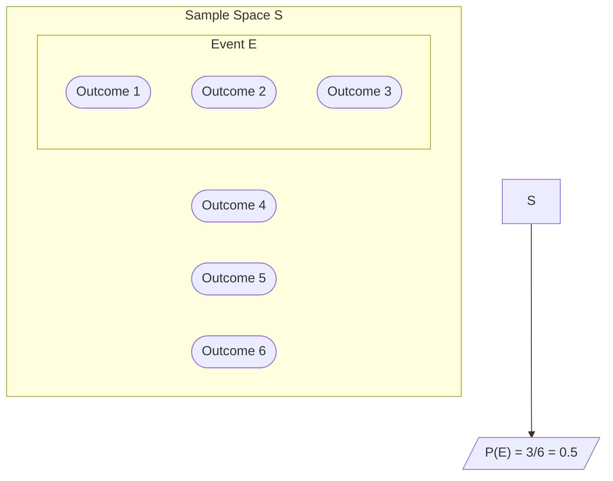
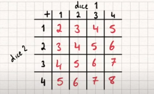
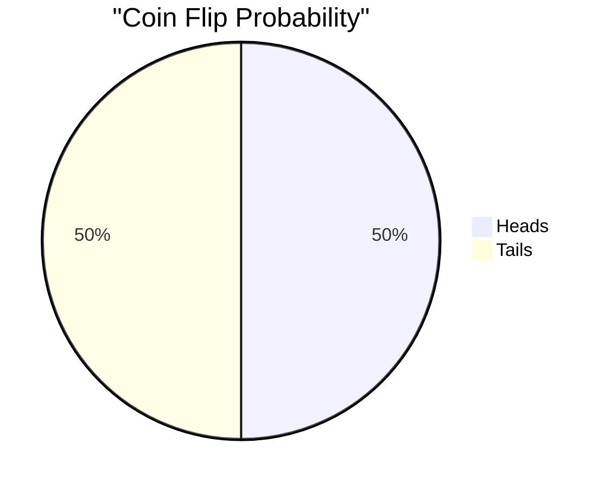
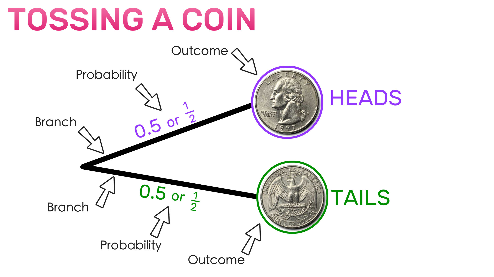
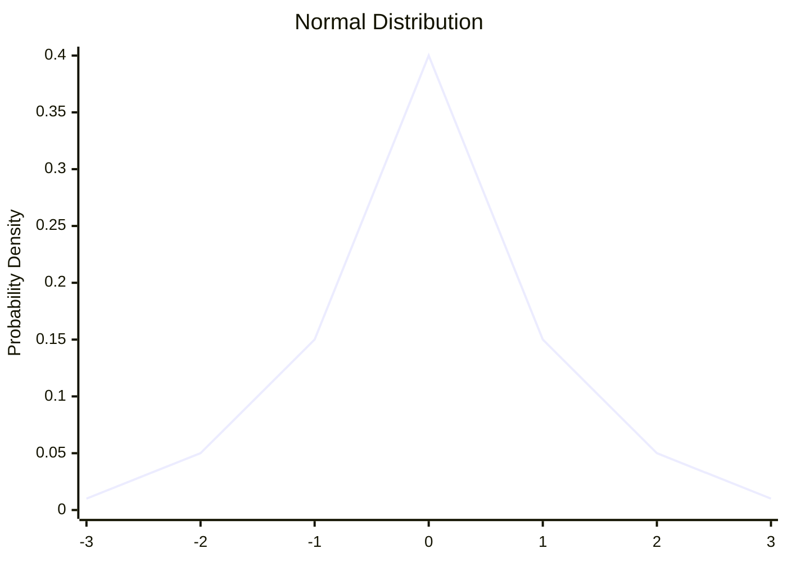
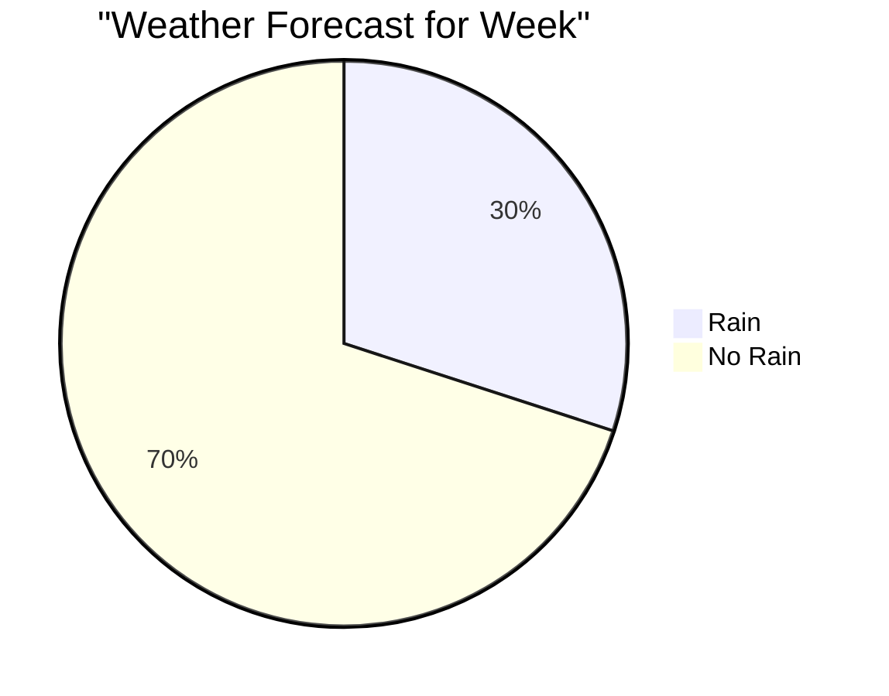
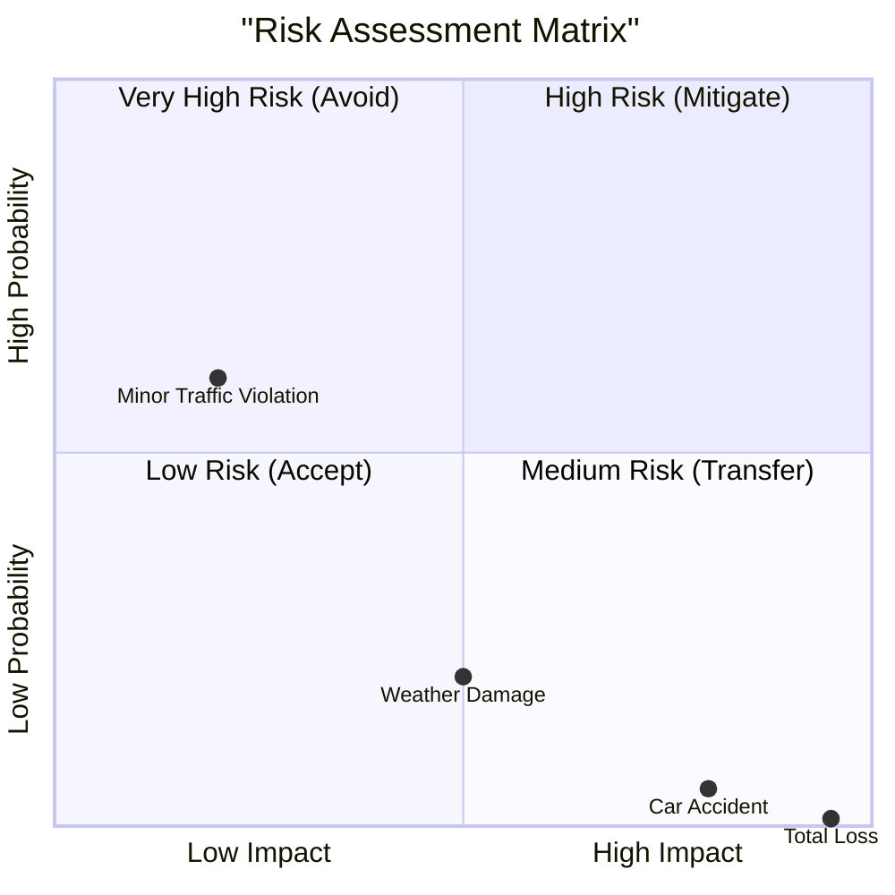
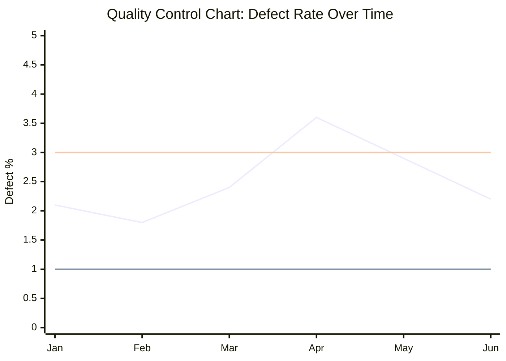

# Lesson 4: Basic Probability Concepts 🎲🎯

<div style="background-color: #2d3748; color: white; padding: 15px; border-radius: 10px; margin-bottom: 20px;">
<h2 style="color: #81e6d9; margin-top: 0;">Essential Mathematics and Statistics for Data Analysis</h2>
<p><strong>Course Progress:</strong> [◉◉◉◉◉◯] 83% Complete  (2 hours) </p>
<p><strong>Lesson Path:</strong> <a href="lesson_1_1.md" style="color: #90cdf4;">Arithmetic Review</a> → <a href="lesson_1_2.md" style="color: #90cdf4;">Introduction to Algebra</a> → <a href="lesson_2.md" style="color: #90cdf4;">Central Tendency</a> → <a href="lesson_3.md" style="color: #90cdf4;">Variability</a> → <mark style="background-color: #4a5568; color: white;">Basic Probability</mark> → Inferential Statistics → Correlation</p>
</div>

## Overview 🔍
**Duration**: ⏱️ 2 hours
**Prerequisites**: 📚 Basic arithmetic, familiarity with fractions and decimals
**Date**: 📅 April 22, 2025
**Key Question**: *How can we mathematically quantify uncertainty?*

---

## Learning Objectives 🎯
By the end of this lesson, you will be able to:
- ✅ Define fundamental probability terms
- ✅ Calculate basic probabilities
- ✅ Recognize normal distribution characteristics
- ✅ Apply probability concepts to real-world scenarios

> 💡 **Why This Matters**: Probability is the foundation of statistical inference, machine learning algorithms, and data-driven decision making. Understanding probability helps us quantify uncertainty in our predictions and models.

---

## 1. Introduction to Probability 🎲

### Basic Definitions 📝

| Term | Definition |
|------|------------|
| **Sample Space (S)** 🌐 | The set of all possible outcomes of an experiment |
| **Event (E)** 🎯 | A subset of the sample space; a collection of outcomes |
| **Outcome** 🎪 | A single result of an experiment |
| **Probability P(E)** 📊 | A measure of the likelihood of an event occurring |

#### Visualization of Sample Space 👁️







### Probability Rules 📏

1. **Rule 1** 1️⃣: The probability of any event is between 0 and 1 inclusive.
   $$0 \leq P(E) \leq 1$$

2. **Rule 2** 2️⃣: The sum of the probabilities of all possible outcomes equals 1.
   $$\sum P(\text{outcome}_i) = 1$$

3. **Rule 3** 3️⃣: For mutually exclusive events E and F:
   $$P(E \text{ or } F) = P(E) + P(F)$$

4. **Rule 4** 4️⃣: For any event E:
   $$P(\text{not } E) = 1 - P(E)$$

#### Example: Coin Flip 🪙

```
Sample Space S = {Heads, Tails}
P(Heads) = 1/2 = 0.5
P(Tails) = 1/2 = 0.5
P(Heads) + P(Tails) = 1 ✓
```



*Figure 3: Probability distribution for a fair coin flip*



*Figure 4: Probability distribution for a fair coin flip*

---

## 2. Probability Distributions 📊

### Normal Distribution Overview 🔔

The normal distribution (also called Gaussian distribution) is a continuous probability distribution that is symmetrical around its mean, showing that data near the mean are more frequent in occurrence than data far from the mean.

#### Key Characteristics ✨:
- 🔔 Bell-shaped curve
- ⚖️ Symmetrical about the mean
- 📊 Mean, median, and mode are equal
- 🧮 Defined by two parameters: mean ($\mu$) and standard deviation ($\sigma$)
- 📏 Approximately 68% of data falls within $1\sigma$ of the mean
- 📏📏 Approximately 95% of data falls within $2\sigma$ of the mean
- 📏📏📏 Approximately 99.7% of data falls within $3\sigma$ of the mean (the "68-95-99.7 rule")



*Figure 5: Approximation of normal distribution showing the bell curve shape*

#### Standard Normal Distribution 📈

The standard normal distribution has a mean of 0 and a standard deviation of 1.


*Figure 7: Z-scores and corresponding areas under the standard normal curve*

---

## 3. Real-world Applications 🌎

### Probability in Decision-Making 🧠

#### Weather Forecasting ☔🌤️
Meteorologists use probability to express the likelihood of precipitation:
- "30% chance of rain" means that, based on current conditions, similar weather patterns have resulted in rainfall 30% of the time.



*Figure 9: Weather forecast showing 30% probability of precipitation*

#### Risk Assessment ⚠️
Insurance companies use probability to calculate risk and set premium rates:

$$P(\text{car accident in next year}) = 0.05$$
$$\text{Cost if accident occurs} = \$15,000$$
$$\text{Expected cost} = 0.05 \times \$15,000 = \$750$$



*Figure 10: Risk assessment matrix showing probability vs. impact for different insurance events*


*Figure 12: Risk assessment matrix showing probability vs. impact*

#### Quality Control 🏭
Manufacturers use probability to determine acceptable defect rates:



*Figure 13: Control chart showing probability of defects over time. The horizontal lines represent the upper control limit (3.0%) and lower control limit (1.0%).*

---

## 4. Activities 🏋️‍♀️

### Activity 1: Basic Probability Calculations 🧮

#### Exercise 1: Dice Rolls 🎲
A fair six-sided die is rolled once.
1. What is the probability of rolling a 4?
2. What is the probability of rolling an even number?
3. What is the probability of rolling a number greater than 4?

#### Exercise 2: Card Drawing 🃏
From a standard 52-card deck:
1. What is the probability of drawing an ace?
2. What is the probability of drawing a heart?
3. What is the probability of drawing a face card (Jack, Queen, or King)?


### Activity 2: Interactive Quiz 📝

Test your understanding with the following questions:

1. If you flip a fair coin 3 times, what is the probability of getting exactly 2 heads?
   - [ ] 1/8
   - [ ] 1/4
   - [x] 3/8
   - [ ] 1/2

2. A bag contains 5 red marbles, 3 blue marbles, and 2 green marbles. If you draw one marble at random, what is the probability of drawing a red or green marble?
   - [ ] 1/2
   - [ ] 5/10
   - [ ] 6/10
   - [x] 7/10

3. The probability that it will rain tomorrow is 0.3. What is the probability that it will not rain tomorrow?
   - [ ] 0.3
   - [ ] 0.6
   - [x] 0.7
   - [ ] 0.4

4. In a normal distribution, approximately what percentage of data falls within 1 standard deviation of the mean?
   - [ ] 50%
   - [x] 68%
   - [ ] 95%
   - [ ] 99.7%

---

## 5. Practice Problems 📝

1. A jar contains 6 red balls and 4 blue balls. If two balls are drawn randomly without replacement, what is the probability that both balls are red? 🔴🔴

2. A study found that 65% of people prefer tea over coffee. If 4 people are selected at random, what is the probability that exactly 3 of them prefer tea? ☕🍵

3. The heights of adult women in a certain population follow a normal distribution with mean 165 cm and standard deviation 6 cm. 📏👩‍🦰
   - What percentage of women have heights between 159 cm and 171 cm?
   - What is the probability that a randomly selected woman is taller than 177 cm?

---

## 6. Additional Resources 📚

### Recommended Readings 📖
- "Probability: For the Enthusiastic Beginner" by David J. Morin
- "Introduction to Probability" by Joseph K. Blitzstein and Jessica Hwang

### Interactive Simulators 💻
- [Coin Flip Simulator](https://www.mathsisfun.com/data/coin-tossing-experiment.html)
- [Normal Distribution Interactive](https://www.geogebra.org/m/RRBz8zWA)

---

## 7. Glossary 📔

| Term | Definition |
|------|------------|
| **Compound Event** 🔄 | An event that consists of multiple simple events |
| **Conditional Probability** 🔀 | The probability of an event occurring given that another event has occurred |
| **Independent Events** 🔓 | Events where the occurrence of one does not affect the probability of the other |
| **Mutually Exclusive** ⚔️ | Events that cannot occur simultaneously |
| **Random Variable** 🎲 | A variable whose possible values are outcomes of a random phenomenon |

---

<div style="background-color: #2d3748; color: white; padding: 15px; border-radius: 10px; margin-top: 20px;">
<h3 style="color: #81e6d9; margin-top: 0;">Next Lesson: Inferential Statistics Basics ➡️</h3>
<p>Coming up next, we'll explore how to use sample data to make inferences about entire populations, building on the probability concepts you've learned today.</p>
<p><a href="lesson_5.md" style="color: #90cdf4;">Continue to Lesson 5 →</a></p>
</div>
