# Lesson 5: Inferential Statistics Basics 📊🔍

<h2 style="color: #81e6d9; margin-top: 0;">Essential Mathematics and Statistics for Data Analysis</h2>

<strong>Course Progress:</strong> [◉◉◉◉◯◯] 67% Complete (2 hours) 

<strong>Lesson Path:</strong> Descriptive Statistics → Measures of Central Tendency → Basic Probability → <mark style="background-color: #4a5568; color: white;">Inferential Statistics</mark> → Correlation

## Overview 🔍
**Duration**: ⏱️ 2 hours
**Topics**: 📚 Population vs sample, sampling techniques, hypothesis testing, confidence intervals
**Key Question**: *How can we use samples to make reliable conclusions about entire populations?*

> 💡 **Why This Matters**: Inferential statistics allows data scientists to draw conclusions about populations without testing everyone - critical for practical research, business decisions, and machine learning model evaluation.

---

## 1. Understanding Inferential Statistics 🧠

### Population vs Sample 🔄

Inferential statistics allows us to make educated guesses about a population based on a smaller sample.

| Concept | Definition | Example |
|---------|------------|---------|
| **Population** 🌍 | The entire group you want to understand | All Netflix subscribers worldwide |
| **Sample** 🔎 | A subset of the population | 1,000 randomly selected Netflix subscribers |
| **Population Parameter** 📊 | A numeric value describing the population | Average age of all subscribers ($\mu$) |
| **Sample Statistic** 📈 | A numeric value describing the sample | Average age of sampled subscribers ($\bar{x}$) |

---

### Sampling Techniques 🧪

The way we select our sample affects how well it represents the population.

#### Random Sampling 🎲
Every member of the population has an equal chance of being selected.

#### Stratified Sampling 📋
The population is divided into distinct subgroups (strata), then samples are taken from each stratum.

#### Convenience Sampling 🛒
Participants are selected based on availability and accessibility.

> ⚠️ **Warning**: Convenience sampling can introduce bias into your results because the sample may not represent the whole population!

---

## 2. Hypothesis Testing 🧪

### Conceptual Overview 🔬

Hypothesis testing helps us determine if observed effects are statistically significant or just due to chance.

```mermaid
sequenceDiagram
    participant N as Null Hypothesis (H₀)
    participant A as Alternative Hypothesis (H₁)
    participant D as Data
    participant P as p-value
    participant C as Conclusion
    N->>D: Assume true
    A->>D: Testing against
    D->>P: Calculate
    P->>C: Compare to α (typically 0.05)
    C->>N: Reject if p < α
    C->>A: Accept if p < α
```

### Null vs. Alternative Hypotheses ⚖️

| Type | Symbol | Description | Example |
|------|--------|-------------|---------|
| Null Hypothesis | $H_0$ 🚫 | The "no effect" or "no difference" claim | "The new website design doesn't affect conversion rates" |
| Alternative Hypothesis | $H_1$ or $H_a$ ✅ | The claim we're testing for | "The new website design increases conversion rates" |

*Note: Imagine this illustrates the decision process in hypothesis testing*

### Understanding p-value 🔢

The p-value tells us the probability of observing our data (or more extreme) if the null hypothesis were true.

```mermaid
graph LR
    A[p-value] --> B[p < 0.05]
    A --> C[p ≥ 0.05]
    B --> D[Reject Null Hypothesis]
    C --> E[Fail to Reject Null Hypothesis]
    D --> F[Results are statistically significant]
    E --> G[Results are not statistically significant]
    style A fill:#3c366b,stroke:#e2e8f0,stroke-width:2px
    style B fill:#2c7a7b,stroke:#e2e8f0,stroke-width:2px
    style C fill:#742a2a,stroke:#e2e8f0,stroke-width:2px
    style D fill:#2d3748,stroke:#e2e8f0,stroke-width:2px
    style E fill:#2d3748,stroke:#e2e8f0,stroke-width:2px
    style F fill:#285e61,stroke:#e2e8f0,stroke-width:2px
    style G fill:#63171b,stroke:#e2e8f0,stroke-width:2px
```

> 📌 **Practical Interpretation**: A small p-value (typically $\leq 0.05$) suggests that the data is inconsistent with the null hypothesis, so we reject it. This doesn't "prove" the alternative hypothesis; it simply means our evidence conflicts with the null.

---

## 3. Confidence Intervals 📏

### What is a Confidence Interval? 🔍

A confidence interval provides a range of values that likely contains the unknown population parameter.

### How to Interpret Confidence Intervals 📊

For example, a 95% confidence interval means that if we took many samples and calculated the confidence interval for each, about 95% of those intervals would contain the true population parameter.

In the enhanced visualization above:
- Each sample shows its mean value and the upper and lower bounds of its 95% confidence interval
- Blue boxes represent samples where the confidence interval contains the true population mean ($\mu = 73$) ✅
- The red box (Sample 3) represents a confidence interval that does not contain the true population mean ❌
- This illustrates the key concept of 95% confidence level: approximately 95% of similarly constructed intervals (4 out of 5 in our example) will contain the true parameter
- Note how Sample 2's upper bound just reaches the true mean (73), while Sample 3's interval misses it completely

---

## Activities 🏋️‍♀️

### Activity 1: Interpreting Hypothesis Tests 🔬

#### Scenario 📋:
A company claims their new training program increases employee productivity. They tested 50 employees before and after the program, finding the average productivity increased by 15%.

**Task** 📝: In groups, discuss:
1. What would be the null and alternative hypotheses?
2. If the p-value is 0.03, what conclusion would you draw?
3. What practical advice would you give to the company based on these results?

Click for Sample Solution 💡

1. **Null Hypothesis ($H_0$)** 🚫: The training program has no effect on employee productivity ($\mu_{difference} = 0$)
   **Alternative Hypothesis ($H_1$)** ✅: The training program increases employee productivity ($\mu_{difference} > 0$)

2. Since $p = 0.03 < 0.05$ (typical significance level), we reject the null hypothesis. The increase in productivity is statistically significant. ✅

3. **Practical Advice** 💼:
   - The training program appears effective and could be rolled out more widely 📈
   - Consider a cost-benefit analysis (does 15% productivity increase justify the training cost?) 💰
   - Monitor long-term effects to ensure productivity gains persist over time ⏳

### Activity 2: Analyzing Confidence Intervals 📊

#### Example from Market Research 🛒:
"Our survey found that 72% of consumers prefer our product, with a 95% confidence interval of 68% to 76%."

**Discussion Questions** 🤔:
1. What does this confidence interval tell us?
2. How would your interpretation change if the confidence interval was 52% to 92%?
3. How could the company use this information for decision-making?

---

## Common Misconceptions ❌

| Misconception | Reality |
|---------------|---------|
| "Statistical significance means practical importance" ❌ | A result can be statistically significant but have a tiny effect size that doesn't matter in practice ✅ |
| "A p-value tells us the probability that our hypothesis is true" ❌ | A p-value is the probability of observing our data (or more extreme) if the null hypothesis were true ✅ |
| "A 95% confidence interval means there's a 95% probability the parameter lies within it" ❌ | It means if we repeated our sampling many times, about 95% of the intervals would contain the true parameter ✅ |
| "Large samples always give accurate results" ❌ | Large samples with bias can still lead to incorrect conclusions ⚠️ |

---

## Key Takeaways 🗝️

1. ✅ Inferential statistics helps us make conclusions about populations based on sample data
2. ✅ The sampling technique you choose affects how well you can generalize findings
3. ✅ Hypothesis testing is about determining whether observed effects are likely due to chance
4. ⚠️ A p-value is not the probability that your hypothesis is true
5. 📊 Confidence intervals provide a range of plausible values for population parameters

---

<h3 style="color: #81e6d9; margin-top: 0;">Next Lesson Preview: Correlation vs. Causation ➡️</h3>

Coming up next, we'll examine the critical distinction between correlation and causation, and learn how to interpret relationships between variables correctly.

