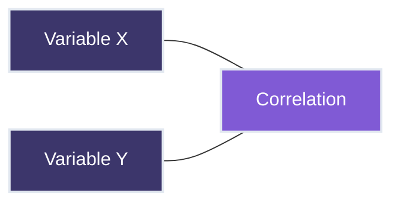
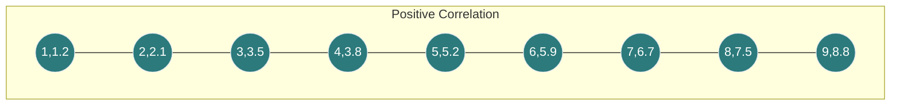
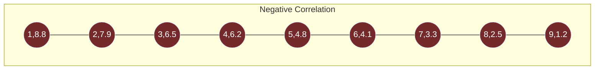
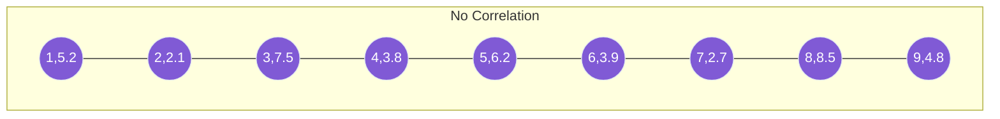
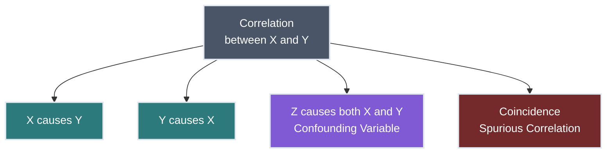
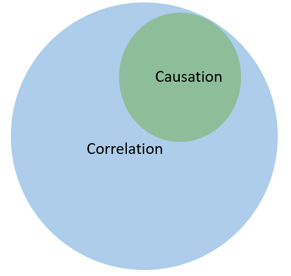
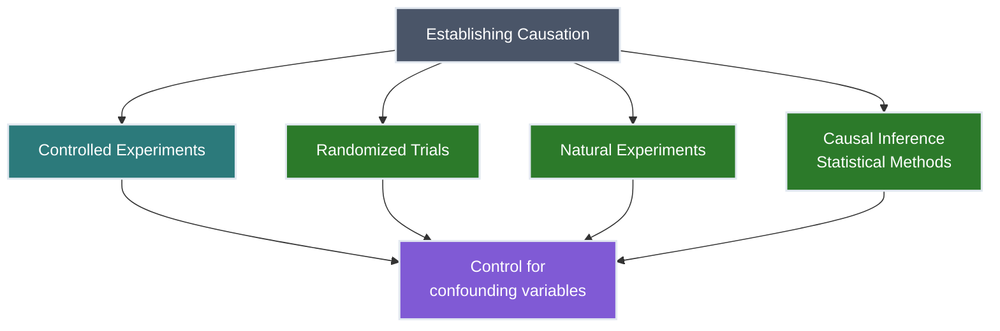
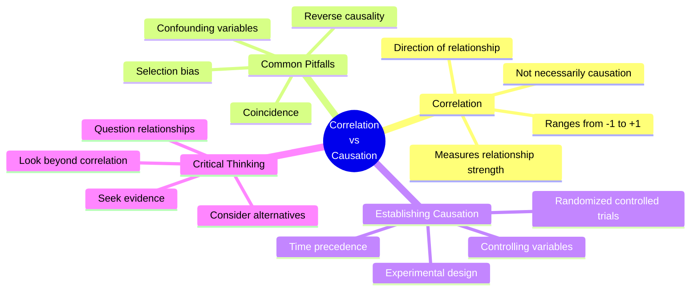

# Lesson 6: Correlation vs. Causation 📊🔄

<h2 style="color: #81e6d9; margin-top: 0;">Essential Mathematics and Statistics for Data Analysis</h2>

<strong>Course Progress:</strong> [◉◉◉◉◉◉] 100% Complete

<strong>Lesson Path:</strong> <a href="lesson_1_1.md" style="color: #90cdf4;">Arithmetic Review</a> → <a href="lesson_1_2.md" style="color: #90cdf4;">Introduction to Algebra</a> → <a href="lesson_2.md" style="color: #90cdf4;">Central Tendency</a> → <a href="lesson_3.md" style="color: #90cdf4;">Variability</a> → <a href="lesson_4.md" style="color: #90cdf4;">Basic Probability</a> → <a href="lesson_5.md" style="color: #90cdf4;">Inferential Statistics</a> → <mark style="background-color: #4a5568; color: white;">Correlation vs. Causation</mark>

## Overview 🔍
**Duration**: ⏱️ 1 hour
**Topics**: 📚 Understanding correlation, types of correlation, correlation vs. causation, real-world examples
**Key Question**: *When does a relationship between variables imply that one causes the other?*

> 💡 **Why This Matters**: The distinction between correlation and causation is critical in data analysis. Misinterpreting correlations as causal relationships can lead to flawed conclusions, ineffective business strategies, and wasted resources.

---

## 1. What is Correlation? 🔄

Correlation measures the strength and direction of the relationship between two variables.

### Key Properties of Correlation 📝
- Ranges from -1 to +1 📏
- Describes linear relationships 📈
- Is symmetric (correlation of X with Y = correlation of Y with X) ⚖️
- Is not affected by changes in scale or units 🔄

*Note: Imagine this showing a scatterplot with a positive correlation pattern*

---

### Types of Correlation 📊

```mermaid
flowchart TB
    A[Types of Correlation] --> B[Positive Correlation<br>r > 0]
    A --> C[Negative Correlation<br>r < 0]
    A --> D[Zero Correlation<br>r ≈ 0]

    subgraph PC["Positive Correlation Example"]
        direction LR
        P1(("X↑")) -.- P2(("Y↑"))
    end

    subgraph NC["Negative Correlation Example"]
        direction LR
        N1(("X↑")) -.- N2(("Y↓"))
    end

    subgraph ZC["Zero Correlation Example"]
        direction LR
        Z1(("X↑")) -.- Z2(("Y⟷"))
    end

    B --- PC
    C --- NC
    D --- ZC

    style A fill:#4a5568,stroke:#e2e8f0,stroke-width:2px,color:#ffffff
    style B fill:#2c7a7b,stroke:#e2e8f0,stroke-width:2px,color:#ffffff
    style C fill:#742a2a,stroke:#e2e8f0,stroke-width:2px,color:#ffffff
    style D fill:#805ad5,stroke:#e2e8f0,stroke-width:2px,color:#ffffff

    style PC fill:#2d3748,stroke:#e2e8f0,stroke-width:1px
    style NC fill:#2d3748,stroke:#e2e8f0,stroke-width:1px
    style ZC fill:#2d3748,stroke:#e2e8f0,stroke-width:1px

    style P1 fill:#2c7a7b,stroke:#e2e8f0,stroke-width:1px,color:#ffffff
    style P2 fill:#2c7a7b,stroke:#e2e8f0,stroke-width:1px,color:#ffffff
    style N1 fill:#742a2a,stroke:#e2e8f0,stroke-width:1px,color:#ffffff
    style N2 fill:#742a2a,stroke:#e2e8f0,stroke-width:1px,color:#ffffff
    style Z1 fill:#805ad5,stroke:#e2e8f0,stroke-width:1px,color:#ffffff
    style Z2 fill:#805ad5,stroke:#e2e8f0,stroke-width:1px,color:#ffffff
```

#### Positive Correlation ($$r > 0$$) 📈
When one variable increases, the other tends to increase as well.

**Examples:**
- 📏 Height and weight
- 📚 Study time and test scores
- 💰 Income and spending

**Note**: The chart above shows data points trending upward as X increases, demonstrating a positive correlation.

#### Negative Correlation ($$r < 0$$) 📉
When one variable increases, the other tends to decrease.

**Examples:**
- 💸 Price and demand
- ❤️ Exercise and resting heart rate
- 🏫 Distance from school and attendance rate

**Note**: The chart above shows data points trending downward as X increases, demonstrating a negative correlation.

#### Zero Correlation ($$r \approx 0$$) ⚖️
No linear relationship between the variables.

**Examples:**
- 👟 Shoe size and intelligence
- 💇‍♀️ Hair color and typing speed
- 📞 Last digit of phone number and height

**Note**: The chart above shows data points scattered with no clear pattern as X increases, demonstrating no correlation between the variables.

> 📝 **Note**: The correlation coefficient ($$r$$) measures both the strength and direction. Values close to +1 or -1 indicate strong relationships, while values near 0 indicate weak relationships.

---

## 2. Misinterpretations of Correlation ⚠️

### Correlation Does Not Imply Causation ❌

Just because two variables are correlated does not mean one causes the other. This is one of the most common statistical fallacies! 🚫

#### Possible Explanations for Correlation 🤔:

1. **Direct Causation** ➡️: X → Y or Y → X
2. **Confounding Variable** 🔄: A third variable Z affects both X and Y
3. **Reverse Causation** ⬅️: Y → X (opposite of what was assumed)
4. **Spurious Correlation** 🎭: Random chance or coincidence
5. **Bidirectional Relationship** ↔️: X ↔ Y (they affect each other)

*Note: Imagine this showing variables that appear related but have no causal connection*

---

## 3. Real-World Examples and Pitfalls 🧩

### Example 1: Ice Cream Sales and Drowning Deaths 🍦🏊‍♂️

**Correlation** 📊: Ice cream sales and drowning deaths both increase in summer months.
**Reality** 🔍: Both are caused by warmer weather ☀️. Ice cream doesn't cause drowning!

🧠 Think Deeper

If we didn't know about the confounding variable (temperature):
- We might observe that ice cream sales and drowning deaths rise and fall together
- The correlation coefficient would be strongly positive
- A naive analysis might suggest reducing ice cream sales to prevent drownings! 😱

This example illustrates how hidden variables can create seemingly causal relationships between unrelated phenomena.

### Example 2: Shoe Size and Reading Ability in Children 👟📚

**Correlation** 📊: Children with larger shoe sizes tend to read better.
**Reality** 🔍: Both shoe size and reading ability increase with age 👶→👦→👧. Bigger feet don't improve reading!

### Example 3: Spurious Correlations 🧀🛌

**Correlation** 📊: Between 2000-2009, cheese consumption correlated with bedsheet tangling deaths.
**Reality** 🔍: This is pure coincidence – there's no logical connection.

> ⚠️ **Warning**: Be especially careful with correlations in news headlines that suggest causation without proper evidence!

---

## 4. How to Establish Causation 🔬

To move beyond correlation and establish causation, you typically need:

1. **Time sequence** ⏰: Cause must precede effect
2. **Strength of association** 💪: Stronger correlations are more suggestive
3. **Consistency** 🔄: Results replicated across different studies
4. **Biological plausibility** 🧬: Mechanism that explains the relationship
5. **Dose-response relationship** 📈: More of the cause leads to more of the effect

---

## Activity: Analyzing Real-World Examples 🏋️‍♀️

### Exercise 1: Evaluate These Correlations 🧐

For each scenario below, discuss:
- Is there a correlation? What type?
- Could one variable cause the other?
- What might be alternative explanations?

1. **Scenario** 🍫: Countries with higher chocolate consumption have more Nobel Prize winners per capita.
2. **Scenario** 🧯: Cities with more firefighters have more fire damage.
3. **Scenario** 👞: People who sleep with their shoes on wake up with headaches.
4. **Scenario** 🦢: The number of storks in an area correlates with the birth rate.

Sample Analysis for Scenario 1 💡

**Countries with higher chocolate consumption have more Nobel Prize winners per capita** 🍫🏆

- **Is there a correlation?** Yes, studies have shown a positive correlation between per capita chocolate consumption and Nobel laureates per 10 million population.

- **Could one cause the other?** Unlikely. Chocolate consumption almost certainly doesn't directly cause Nobel Prize achievement.

- **Alternative explanations:** 🤔
  - Wealth 💰: Richer countries can afford both more chocolate and better education systems
  - Research funding 🔬: Countries that prioritize research spending have both higher education levels (leading to Nobel Prizes) and higher disposable income (for luxury items like chocolate)
  - Cultural factors 🏛️: Some cultures that value intellectual achievement might also have dietary patterns that include more chocolate

- **Lesson**: This is a classic example of correlation without causation, likely explained by confounding variables.

### Exercise 2: Identify the Relationship 😴

**Note**: The chart above shows a non-linear relationship between hours of sleep and productivity. Notice how productivity increases with sleep up to around 7-8 hours, then begins to decrease with more sleep.

1. What type of relationship do you observe? 🤔
2. Can we conclude that sleep directly causes changes in productivity? 💭
3. What confounding variables might be at play? 🧩
4. How would you design a study to test the causal relationship? 🔬

## Decision-Making Checklist ✅

When evaluating potential causal relationships in data:

✅ Look for correlation first (no causation without correlation)
✅ Consider the temporal sequence (cause must precede effect)
✅ Check for confounding variables
✅ Examine if the relationship persists across different contexts
✅ Consider biological/logical plausibility
✅ Look for consistent dose-response relationships
✅ Seek experimental evidence when possible
❌ Never conclude causation from correlation alone

---

## Key Takeaways 🗝️

1. ✅ Correlation quantifies the relationship between variables but doesn't imply causation
2. 🧠 When we observe correlation, always consider alternative explanations
3. 🔍 Understanding confounding variables helps prevent incorrect causal claims
4. 🧪 Experimental design with controlled conditions is key to establishing causation
5. 🤔 Critical thinking about data relationships is essential for accurate analysis

---

<h3 style="color: #81e6d9; margin-top: 0;">Course Complete! 🎓🎉</h3>

Congratulations on completing the Essential Mathematics and Statistics for Data Analysis course! You now have the fundamental mathematical and statistical knowledge needed to approach data analysis with confidence.

<a href="course_overview.md" style="color: #90cdf4;">Return to Course Overview →</a>

