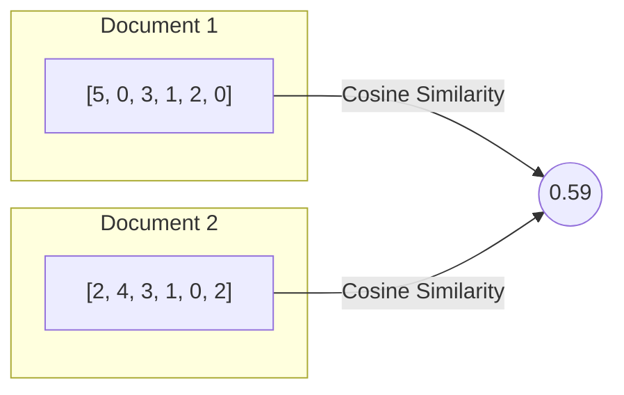
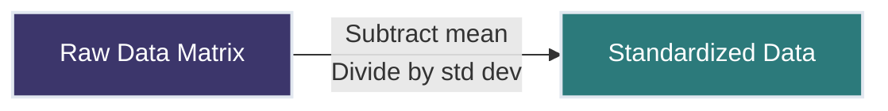
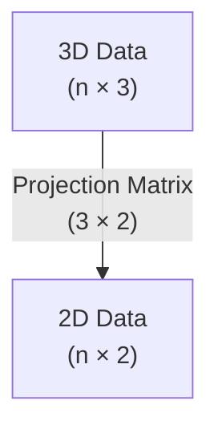
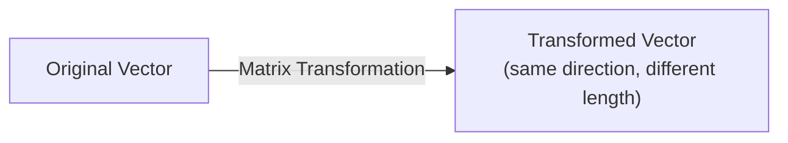
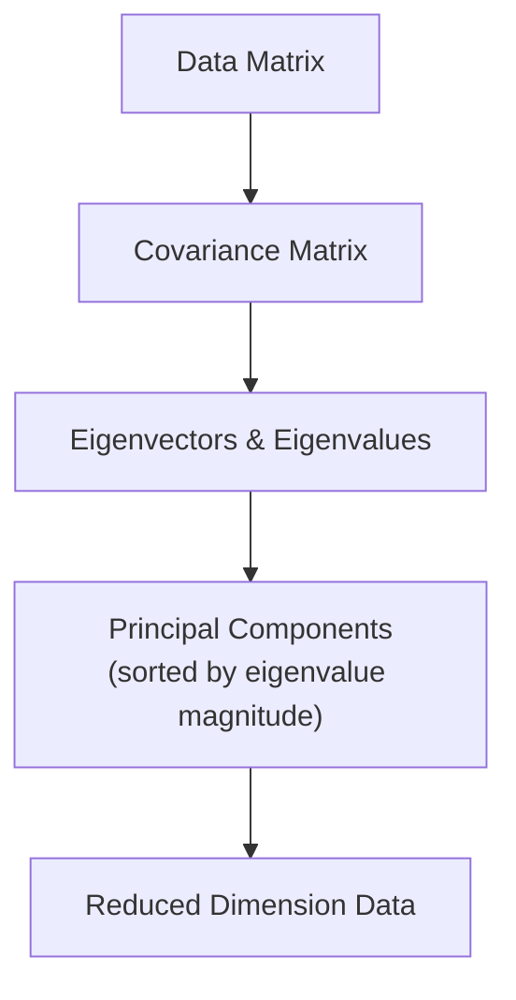

# Lesson 7: Linear Algebra Fundamentals (Bonus) 🧮🔢

<div style="background-color: #2d3748; color: white; padding: 15px; border-radius: 10px; margin-bottom: 20px;">
<h2 style="color: #81e6d9; margin-top: 0;">Essential Mathematics and Statistics for Data Analysis</h2>
<p><strong>Course Progress:</strong> [◉◉◉◉◉◉◉] Bonus Content</p>
<p><strong>Lesson Path:</strong> <a href="lesson_1_1.md" style="color: #90cdf4;">Arithmetic Review</a> → <a href="lesson_1_2.md" style="color: #90cdf4;">Introduction to Algebra</a> → <a href="lesson_2.md" style="color: #90cdf4;">Central Tendency</a> → <a href="lesson_3.md" style="color: #90cdf4;">Variability</a> → <a href="lesson_4.md" style="color: #90cdf4;">Basic Probability</a> → <a href="lesson_5.md" style="color: #90cdf4;">Inferential Statistics</a> → <a href="lesson_6.md" style="color: #90cdf4;">Correlation vs. Causation</a> → <mark style="background-color: #4a5568; color: white;">Linear Algebra (Bonus)</mark></p>
</div>

## Overview 🔍
**Duration**: ⏱️ 2 hours
**Prerequisites**: 📚 Introduction to Algebra (Lesson 1.2)
**Date**: 📅 April 29, 2025
**Key Question**: *How do linear algebra concepts enhance data analysis capabilities?*

> 💡 **Why This Matters**: Linear algebra provides the mathematical foundation for many data analysis techniques including dimensionality reduction, recommendation systems, and machine learning algorithms. Understanding these concepts will allow you to work more effectively with multidimensional data and implement advanced analytical methods.

---

## Learning Objectives 🎯
By the end of this lesson, you will be able to:
- ✅ Represent and manipulate data using vectors and matrices
- ✅ Perform basic matrix operations essential for data analysis
- ✅ Understand eigenvalues and eigenvectors conceptually
- ✅ Apply linear transformations to datasets
- ✅ Recognize how linear algebra concepts appear in common data analysis techniques

---

## 1. Vectors: The Building Blocks 📏

### What is a Vector? 🔢

A **vector** is an ordered collection of numbers. In data analysis, each number in a vector often represents a measurement or feature of an observation.

#### Representation 📝
A vector with $n$ elements is written as:

$$\vec{v} = \begin{bmatrix} v_1 \\ v_2 \\ \vdots \\ v_n \end{bmatrix}$$

#### Example in Data Analysis 👨‍💼
A customer profile vector might look like:

$$\text{customer} = \begin{bmatrix} \text{age} \\ \text{income} \\ \text{years\_as\_customer} \\ \text{purchases\_last\_month} \end{bmatrix} = \begin{bmatrix} 34 \\ 65000 \\ 3.5 \\ 7 \end{bmatrix}$$

### Vector Operations 🧮

#### Addition and Subtraction ➕➖
Adding or subtracting vectors of the same length is done element-wise:

$$\begin{bmatrix} a_1 \\ a_2 \\ a_3 \end{bmatrix} + \begin{bmatrix} b_1 \\ b_2 \\ b_3 \end{bmatrix} = \begin{bmatrix} a_1 + b_1 \\ a_2 + b_2 \\ a_3 + b_3 \end{bmatrix}$$

#### Scalar Multiplication ✖️
Multiplying a vector by a scalar (number) scales each element:

$$c \begin{bmatrix} v_1 \\ v_2 \\ v_3 \end{bmatrix} = \begin{bmatrix} c \cdot v_1 \\ c \cdot v_2 \\ c \cdot v_3 \end{bmatrix}$$

#### Dot Product 🔄
The dot product of two vectors is the sum of the products of corresponding elements:

$$\vec{a} \cdot \vec{b} = a_1 b_1 + a_2 b_2 + \ldots + a_n b_n = \sum_{i=1}^{n} a_i b_i$$

#### Magnitude (Length) 📏
The magnitude of a vector is:

$$|\vec{v}| = \sqrt{v_1^2 + v_2^2 + \ldots + v_n^2} = \sqrt{\sum_{i=1}^{n} v_i^2}$$

### Vector Applications in Data Analysis 🔍

#### Distance Metrics 📊
Euclidean distance between two data points $\vec{p}$ and $\vec{q}$:

$$d(\vec{p}, \vec{q}) = |\vec{p} - \vec{q}| = \sqrt{\sum_{i=1}^{n} (p_i - q_i)^2}$$

#### Cosine Similarity 📐
Measures the similarity between two non-zero vectors:

$$\text{similarity} = \cos(\theta) = \frac{\vec{a} \cdot \vec{b}}{|\vec{a}||\vec{b}|}$$

*Used in document similarity, recommender systems, and clustering*

#### Example: Document Similarity 📄
Representing two documents as word frequency vectors:



---

## 2. Matrices: Working with Tables of Data 📊

### What is a Matrix? 🔢

A **matrix** is a rectangular array of numbers arranged in rows and columns. In data analysis, matrices typically represent multiple observations (rows) with multiple features (columns).

#### Representation 📝
A matrix with $m$ rows and $n$ columns is written as:

$$A = \begin{bmatrix}
a_{11} & a_{12} & \cdots & a_{1n} \\
a_{21} & a_{22} & \cdots & a_{2n} \\
\vdots & \vdots & \ddots & \vdots \\
a_{m1} & a_{m2} & \cdots & a_{mn}
\end{bmatrix}$$

#### Example in Data Analysis 👥
A dataset of customer information might be represented as:

$$\text{customers} = \begin{bmatrix}
\text{age}_1 & \text{income}_1 & \text{years\_customer}_1 & \text{purchases}_1 \\
\text{age}_2 & \text{income}_2 & \text{years\_customer}_2 & \text{purchases}_2 \\
\vdots & \vdots & \vdots & \vdots \\
\text{age}_n & \text{income}_n & \text{years\_customer}_n & \text{purchases}_n
\end{bmatrix}$$

### Matrix Operations 🧮

#### Addition and Subtraction ➕➖
Adding or subtracting matrices of the same dimensions is done element-wise:

$$A + B = \begin{bmatrix}
a_{11} + b_{11} & a_{12} + b_{12} & \cdots \\
a_{21} + b_{21} & a_{22} + b_{22} & \cdots \\
\vdots & \vdots & \ddots
\end{bmatrix}$$

#### Scalar Multiplication ✖️
Multiplying a matrix by a scalar multiplies each element:

$$cA = \begin{bmatrix}
c \cdot a_{11} & c \cdot a_{12} & \cdots \\
c \cdot a_{21} & c \cdot a_{22} & \cdots \\
\vdots & \vdots & \ddots
\end{bmatrix}$$

#### Matrix Multiplication 🔄
For matrices $A$ (m×n) and $B$ (n×p), the product $C = AB$ (m×p) is:

$$c_{ij} = \sum_{k=1}^{n} a_{ik} b_{kj}$$

#### Transpose 🔄
The transpose of a matrix flips rows and columns:

$$A^T = \begin{bmatrix}
a_{11} & a_{21} & \cdots & a_{m1} \\
a_{12} & a_{22} & \cdots & a_{m2} \\
\vdots & \vdots & \ddots & \vdots \\
a_{1n} & a_{2n} & \cdots & a_{mn}
\end{bmatrix}$$

#### Identity Matrix ⚖️
A square matrix with 1's on the main diagonal and 0's elsewhere:

$$I = \begin{bmatrix}
1 & 0 & \cdots & 0 \\
0 & 1 & \cdots & 0 \\
\vdots & \vdots & \ddots & \vdots \\
0 & 0 & \cdots & 1
\end{bmatrix}$$

For any matrix $A$, $AI = IA = A$

### Matrix Applications in Data Analysis 🔍

#### Data Transformation 🔄
Applying a linear transformation to a dataset:

$$\text{transformed\_data} = \text{data} \times \text{transformation\_matrix}$$

#### Systems of Equations ⚖️
Solving multiple equations simultaneously:

$$A\vec{x} = \vec{b}$$

*Used in regression, finding optimal parameters, and simulations*

#### Example: Feature Transformation 📊
Standardizing a dataset with two features:



---

## 3. Linear Transformations 🔄

### What are Linear Transformations? 🧩

A **linear transformation** is an operation that preserves vector addition and scalar multiplication. In data analysis, transformations help us manipulate, normalize, and project data.

#### Key Properties 📝
For a linear transformation $T$ and vectors $\vec{u}$ and $\vec{v}$:

1. $T(\vec{u} + \vec{v}) = T(\vec{u}) + T(\vec{v})$
2. $T(c\vec{u}) = cT(\vec{u})$ for any scalar $c$

### Common Transformations in Data Analysis 🔄

#### Rotation 🔄
$$\begin{bmatrix}
\cos\theta & -\sin\theta \\
\sin\theta & \cos\theta
\end{bmatrix} \begin{bmatrix} x \\ y \end{bmatrix} = \begin{bmatrix} x\cos\theta - y\sin\theta \\ x\sin\theta + y\cos\theta \end{bmatrix}$$

*Used in data visualization, feature engineering, and dimensionality reduction*

#### Scaling 🔍
$$\begin{bmatrix}
s_x & 0 \\
0 & s_y
\end{bmatrix} \begin{bmatrix} x \\ y \end{bmatrix} = \begin{bmatrix} s_x \cdot x \\ s_y \cdot y \end{bmatrix}$$

*Used in normalization, standardization, and feature weighting*

#### Example: Data Projection 📊
Projecting 3D data onto a 2D plane:



---

## 4. Eigenvalues and Eigenvectors 🔑

### What are Eigenvalues and Eigenvectors? 🧩

For a square matrix $A$, an **eigenvector** is a non-zero vector $\vec{v}$ such that when multiplied by $A$, only its magnitude changes, not its direction:

$$A\vec{v} = \lambda\vec{v}$$

The scalar $\lambda$ is the **eigenvalue** corresponding to $\vec{v}$.

### Conceptual Understanding 🧠

- Eigenvectors represent directions that remain unchanged (except for scaling) when transformed by the matrix 📏
- Eigenvalues represent the amount of stretching or compression along the eigenvector directions 🔍

#### Visual Example 👁️



### Applications in Data Analysis 🔍

#### Principal Component Analysis (PCA) 📊
- Eigenvectors of the data's covariance matrix identify directions of maximum variance
- Eigenvalues indicate the amount of variance explained by each principal component
- Used for dimensionality reduction, noise filtering, and feature extraction

#### Example: Finding Principal Components 🔎



*Figure: The PCA process using eigenvectors/eigenvalues*

---

## 5. Applications to Data Analysis 📊

### Dimensionality Reduction with PCA 📉
PCA uses eigenvectors to find the most important directions in your data:

1. Center the data by subtracting the mean ⚖️
2. Compute the covariance matrix 🔢
3. Find eigenvectors and eigenvalues of the covariance matrix 🔑
4. Sort eigenvectors by decreasing eigenvalues 📊
5. Project data onto top k eigenvectors (principal components) 📏

#### Benefits ✅
- Reduces computational complexity ⚡
- Removes multicollinearity 🔗
- Enables visualization of high-dimensional data 👁️
- Reduces noise 🔊

### Recommendation Systems 👍
Using similarity metrics and matrix operations:


### Natural Language Processing 🔤
Word embeddings use linear algebra to represent semantic relationships:

```
king - man + woman = queen
```

This vector arithmetic works because the embedding space captures meaningful semantic relationships.

### Image Processing 🖼️
Linear transformations for image manipulation:
- Rotation 🔄
- Scaling 🔍
- Compression 📦
- Edge detection 🔍
- Facial recognition 👤

---

## Practice Examples 🏋️‍♀️

### Example 1: Vector Operations 📏
Given the vectors $\vec{a} = [2, 4, 1]$ and $\vec{b} = [3, 0, 5]$:

<details>
<summary>Click for Solution 💡</summary>

**Vector Addition:**
$\vec{a} + \vec{b} = [2+3, 4+0, 1+5] = [5, 4, 6]$

**Dot Product:**
$\vec{a} \cdot \vec{b} = 2 \times 3 + 4 \times 0 + 1 \times 5 = 6 + 0 + 5 = 11$

**Magnitude of $\vec{a}$:**
$|\vec{a}| = \sqrt{2^2 + 4^2 + 1^2} = \sqrt{4 + 16 + 1} = \sqrt{21} \approx 4.58$
</details>

### Example 2: Matrix Multiplication 🧮
Let $A = \begin{bmatrix} 2 & 1 \\ 3 & 4 \end{bmatrix}$ and $B = \begin{bmatrix} 5 & 6 \\ 7 & 8 \end{bmatrix}$. Find $A \times B$.

<details>
<summary>Click for Solution 💡</summary>

$A \times B = \begin{bmatrix} 2 & 1 \\ 3 & 4 \end{bmatrix} \times \begin{bmatrix} 5 & 6 \\ 7 & 8 \end{bmatrix}$

$= \begin{bmatrix}
2 \times 5 + 1 \times 7 & 2 \times 6 + 1 \times 8 \\
3 \times 5 + 4 \times 7 & 3 \times 6 + 4 \times 8
\end{bmatrix}$

$= \begin{bmatrix}
10 + 7 & 12 + 8 \\
15 + 28 & 18 + 32
\end{bmatrix}$

$= \begin{bmatrix}
17 & 20 \\
43 & 50
\end{bmatrix}$
</details>

### Example 3: Eigenvalues and Eigenvectors 🔑
Find the eigenvalues and eigenvectors of $A = \begin{bmatrix} 3 & 1 \\ 1 & 3 \end{bmatrix}$.

<details>
<summary>Click for Solution 💡</summary>

To find eigenvalues, solve $|A - \lambda I| = 0$:

$\begin{vmatrix} 3-\lambda & 1 \\ 1 & 3-\lambda \end{vmatrix} = 0$

$(3-\lambda)^2 - 1 = 0$

$(3-\lambda)^2 = 1$

$3-\lambda = \pm 1$

$\lambda = 3 \pm 1 = 4$ or $\lambda = 2$

For $\lambda = 4$, solve $(A - 4I)\vec{v} = 0$:
$\begin{bmatrix} -1 & 1 \\ 1 & -1 \end{bmatrix} \begin{bmatrix} v_1 \\ v_2 \end{bmatrix} = \begin{bmatrix} 0 \\ 0 \end{bmatrix}$

This gives us $-v_1 + v_2 = 0$, so $v_1 = v_2$
One eigenvector is $\vec{v}_1 = [1, 1]$

For $\lambda = 2$, solve $(A - 2I)\vec{v} = 0$:
$\begin{bmatrix} 1 & 1 \\ 1 & 1 \end{bmatrix} \begin{bmatrix} v_1 \\ v_2 \end{bmatrix} = \begin{bmatrix} 0 \\ 0 \end{bmatrix}$

This gives us $v_1 + v_2 = 0$, so $v_1 = -v_2$
One eigenvector is $\vec{v}_2 = [1, -1]$
</details>

### Example 4: Applied Problem - Data Projection 📊
You have 3D data points and want to project them onto a 2D space for visualization. Your first two principal components (eigenvectors) are $\vec{v}_1 = [0.5, 0.8, 0.3]$ and $\vec{v}_2 = [0.1, -0.2, 0.97]$. Project the point $[4, 7, 2]$ onto this 2D space.

<details>
<summary>Click for Solution 💡</summary>

Let's create a projection matrix $P$ with the principal components as columns:

$P = \begin{bmatrix}
0.5 & 0.1 \\
0.8 & -0.2 \\
0.3 & 0.97
\end{bmatrix}$

The projection of a point $\vec{x} = [4, 7, 2]$ is given by $\vec{x} \cdot P$:

$\vec{x} \cdot \vec{v}_1 = 4 \times 0.5 + 7 \times 0.8 + 2 \times 0.3 = 2 + 5.6 + 0.6 = 8.2$

$\vec{x} \cdot \vec{v}_2 = 4 \times 0.1 + 7 \times (-0.2) + 2 \times 0.97 = 0.4 - 1.4 + 1.94 = 0.94$

So the 3D point $[4, 7, 2]$ is projected to the 2D point $[8.2, 0.94]$.
</details>

---

## 6. Activities 🏋️‍♀️

### Activity 1: Vector Space Visualization 📐

1. Visualize the following vectors in a 2D space: $\vec{a} = [3, 1]$ and $\vec{b} = [1, 2]$
2. Draw the vector $\vec{c} = \vec{a} + \vec{b}$
3. Draw the vector $\vec{d} = 2\vec{a} - \vec{b}$

### Activity 2: Linear Transformation 🔄

Given the transformation matrix $T = \begin{bmatrix} 0.5 & -0.3 \\ 0.3 & 0.5 \end{bmatrix}$:

1. Apply this transformation to the unit square with corners at $(0,0)$, $(1,0)$, $(1,1)$, and $(0,1)$
2. Draw the transformed shape

### Activity 3: Interactive Quiz 🧠

Test your understanding with the following questions:

1. What is the dot product of $[2, 3, 4]$ and $[1, 0, -1]$?
   - [ ] -2
   - [x] -2
   - [ ] 5
   - [ ] 3

2. Which of the following operations is NOT valid? ❌
   - [ ] Adding two vectors of the same length
   - [ ] Multiplying a vector by a scalar
   - [x] Multiplying a 3×4 matrix with a 5×2 matrix
   - [ ] Finding the eigenvalues of a square matrix

3. In PCA, what do the eigenvalues represent? 🔍
   - [ ] The direction of data spread
   - [x] The amount of variance captured by each principal component
   - [ ] The correlation between variables
   - [ ] The optimal number of clusters

4. If a matrix has all eigenvalues equal to 1, what special property does it have? 🤔
   - [ ] It's singular
   - [ ] It's symmetric
   - [x] It preserves lengths during transformation
   - [ ] It's diagonal

---

## 7. Additional Resources 📚

### Recommended Readings 📖
- "Introduction to Linear Algebra" by Gilbert Strang
- "Linear Algebra and Learning from Data" by Gilbert Strang
- "Coding the Matrix: Linear Algebra through Applications to Computer Science" by Philip N. Klein

### Online Resources 🌐
- [Khan Academy Linear Algebra](https://www.khanacademy.org/math/linear-algebra)
- [3Blue1Brown Essence of Linear Algebra](https://www.youtube.com/playlist?list=PLZHQObOWTQDPD3MizzM2xVFitgF8hE_ab)
- [The Matrix Calculus You Need For Deep Learning](https://explained.ai/matrix-calculus/index.html)

### Interactive Tools 🛠️
- [GeoGebra Linear Algebra Applets](https://www.geogebra.org/m/qbg3pssr)
- [Interactive Linear Algebra](http://textbooks.math.gatech.edu/ila/)

---

## 8. Glossary 📖

| Term | Definition |
|------|------------|
| **Vector** 📏 | An ordered collection of numbers representing direction and magnitude |
| **Matrix** 🔢 | A rectangular array of numbers arranged in rows and columns |
| **Dot Product** 🔄 | The sum of the products of corresponding elements of two vectors |
| **Linear Transformation** 📊 | A function between vector spaces that preserves vector addition and scalar multiplication |
| **Eigenvalue** 🔑 | A scalar by which an eigenvector is scaled during a linear transformation |
| **Eigenvector** 📐 | A non-zero vector that, when transformed by a matrix, changes only in scale, not direction |
| **Principal Component** 🔍 | An eigenvector of the data's covariance matrix, representing a direction of maximum variance |
| **Matrix Decomposition** 📊 | Factorizing a matrix into simpler component matrices |
| **Linear System** ⚖️ | A collection of linear equations involving the same variables |
| **Singular Value Decomposition (SVD)** 🧩 | A matrix factorization that generalizes the eigendecomposition |

---

<div style="background-color: #2d3748; color: white; padding: 15px; border-radius: 10px; margin-top: 20px;">
<h3 style="color: #81e6d9; margin-top: 0;">Course Completion 🎓</h3>
<p>Congratulations on completing this bonus lesson on Linear Algebra Fundamentals! You now have a solid understanding of linear algebra concepts that are essential for advanced data analysis and machine learning. 🎉</p>
<p><a href="../course_overview.md" style="color: #90cdf4;">Return to Course Overview →</a></p>
</div>